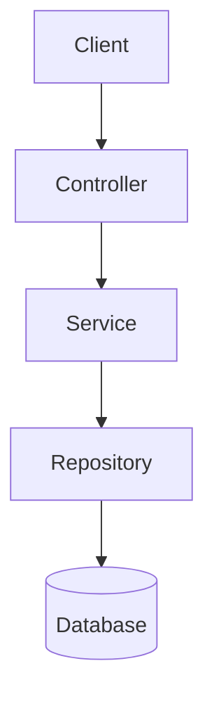

# Implementation Plan: [FEATURE_NAME]

**Spec Reference**: specs/[spec-name]/spec.md
**Version**: 1.0.0
**Author**: [Author Name]
**Created**: [DATE]

---

## Constitution Compliance Check

### Applicable Principles

| Principle | Compliant | Notes |
|-----------|-----------|-------|
| TypeScript Strict Mode | Yes/No | [Notes] |
| FSD-Speckit Sync | Yes/No | [Notes] |
| Documentation Traceability | Yes/No | [Notes] |

### Potential Violations

[List any principles that need special attention or exceptions]

---

## FSD Impact Analysis

### Modules Affected

| Module | Impact | Changes Required |
|--------|--------|------------------|
| module_XX_name | High/Medium/Low | [Description] |

### FSD Updates Plan

1. `module_XX_name/INDEX.md`:
   - Add new endpoint: `POST /api/v1/resource`
   - Add new field to data model

2. `module_XX_name/XX_submodule/spec.md`:
   - Create new spec for [feature]

---

## Architecture Overview

### Component Diagram

### Key Design Decisions

| Decision | Rationale | Alternatives Considered |
|----------|-----------|------------------------|
| [Decision 1] | [Why] | [Options] |

---

## Implementation Approach

### Phase 1: Foundation
- Set up data models
- Create repository layer
- Write unit tests

### Phase 2: Business Logic
- Implement service layer
- Add validation
- Write integration tests

### Phase 3: API Layer
- Create controller
- Add DTOs
- Document endpoints

### Phase 4: FSD Update
- Update INDEX.md
- Create/update spec.md
- Run gap analysis

---

## Dependencies

### Internal Dependencies
- [Service/Module] - [Purpose]

### External Dependencies
- [Library/Service] - [Purpose]

---

## Testing Strategy

| Test Type | Coverage Target | Priority |
|-----------|-----------------|----------|
| Unit Tests | 80% | High |
| Integration Tests | Key flows | High |
| E2E Tests | Happy path | Medium |

---

## Risks & Mitigations

| Risk | Probability | Impact | Mitigation |
|------|-------------|--------|------------|
| [Risk 1] | High/Med/Low | High/Med/Low | [Strategy] |

---

## Success Criteria

- [ ] All acceptance criteria from spec met
- [ ] Unit test coverage >= 80%
- [ ] No critical/high severity bugs
- [ ] FSD documentation updated
- [ ] Code review approved

---

## Approvals

| Role | Name | Date | Signature |
|------|------|------|-----------|
| Tech Lead | | | |
| Architect | | | |
