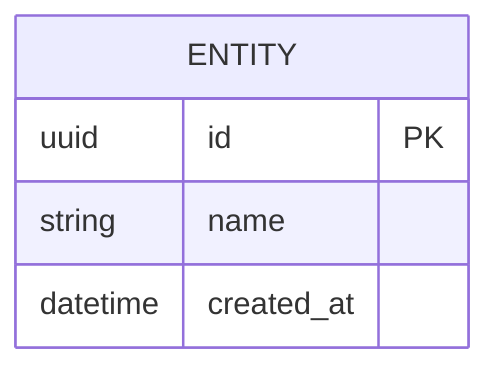
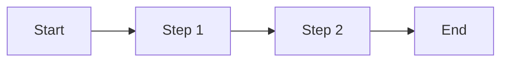

# Feature Specification: [FEATURE_NAME]

**Version**: 1.0.0
**Status**: Draft | In Review | Approved
**Author**: [Author Name]
**Created**: [DATE]
**FSD Reference**: module_XX_name

---

## Overview

[Brief description of the feature - 2-3 sentences]

## FSD Context

### Related Modules
- `module_XX_name` - [relationship]
- `module_YY_name` - [relationship]

### Existing Business Rules
[Summary of relevant existing rules from FSD]

---

## User Stories

### Story 1: [Title]

**As a** [role]
**I want to** [action]
**So that** [benefit]

#### Acceptance Criteria

```gherkin
Given [context]
When [action]
Then [outcome]
```

---

## Requirements

### Functional Requirements

| ID | Requirement | Priority |
|----|-------------|----------|
| FR-001 | [Description] | Must Have |
| FR-002 | [Description] | Should Have |

### Non-Functional Requirements

| ID | Requirement | Target |
|----|-------------|--------|
| NFR-001 | Response time | < 200ms |
| NFR-002 | Availability | 99.9% |

---

## Business Rules

| Rule ID | Description | Error Message |
|---------|-------------|---------------|
| BR-001 | [Rule description] | [Error message if violated] |

---

## API Specification

### Endpoints

#### POST /api/v1/[resource]

**Request:**
```json
{
  "field": "value"
}
```

**Response:**
```json
{
  "id": "uuid",
  "field": "value",
  "createdAt": "2025-01-01T00:00:00Z"
}
```

**Error Responses:**
- `400 Bad Request` - Validation error
- `401 Unauthorized` - Not authenticated
- `403 Forbidden` - Not authorized

---

## Data Model



---

## UI/UX (if applicable)

### Wireframe
[Description or link to wireframe]

### User Flow


---

## FSD Updates Required

After implementation, update:
- [ ] `module_XX_name/INDEX.md` - Add new endpoint/field
- [ ] `module_XX_name/XX_submodule/spec.md` - Update specification
- [ ] `FSD_TASK_LIST.md` - Update progress

---

## Open Questions

| # | Question | Decision | Decided By |
|---|----------|----------|------------|
| 1 | [Question] | [Decision or TBD] | [Name] |

---

## Approvals

| Role | Name | Date | Signature |
|------|------|------|-----------|
| Product Owner | | | |
| Tech Lead | | | |
