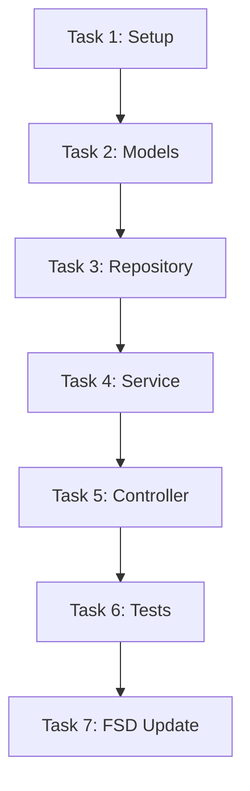

# Task List: [FEATURE_NAME]

**Plan Reference**: specs/[spec-name]/plan.md
**Version**: 1.0.0
**Created**: [DATE]

---

## Overview

Total Tasks: [N]
Estimated Effort: [X] story points

---

## Task Execution Order

---

## Tasks

### Task 1: [Setup/Scaffolding]

**Status**: [ ] Not Started | [ ] In Progress | [ ] Completed

**Description:**
[What needs to be done]

**Files to Create/Modify:**
- `src/modules/feature/` - Create module folder
- `src/modules/feature/feature.module.ts` - Module definition

**Acceptance Criteria:**
- [ ] Module folder structure created
- [ ] Module registered in app

---

### Task 2: [Data Model/Entity]

**Status**: [ ] Not Started | [ ] In Progress | [ ] Completed

**Description:**
[What needs to be done]

**Files to Create/Modify:**
- `src/modules/feature/entities/entity.entity.ts`
- `src/modules/feature/dto/create-entity.dto.ts`
- `src/modules/feature/dto/update-entity.dto.ts`

**Acceptance Criteria:**
- [ ] Entity defined with all fields
- [ ] DTOs with validation decorators
- [ ] Database migration created

---

### Task 3: [Repository Layer]

**Status**: [ ] Not Started | [ ] In Progress | [ ] Completed

**Description:**
[What needs to be done]

**Files to Create/Modify:**
- `src/modules/feature/repositories/entity.repository.ts`

**Acceptance Criteria:**
- [ ] Repository interface defined
- [ ] Implementation with TypeORM/Prisma
- [ ] Unit tests written

---

### Task 4: [Service Layer]

**Status**: [ ] Not Started | [ ] In Progress | [ ] Completed

**Description:**
[What needs to be done]

**Files to Create/Modify:**
- `src/modules/feature/services/entity.service.ts`

**Acceptance Criteria:**
- [ ] Service implements business logic
- [ ] Error handling implemented
- [ ] Unit tests with 80%+ coverage

---

### Task 5: [Controller Layer]

**Status**: [ ] Not Started | [ ] In Progress | [ ] Completed

**Description:**
[What needs to be done]

**Files to Create/Modify:**
- `src/modules/feature/controllers/entity.controller.ts`

**Acceptance Criteria:**
- [ ] Endpoints match API spec
- [ ] Request validation working
- [ ] Response format correct
- [ ] Swagger documentation added

---

### Task 6: [Integration Tests]

**Status**: [ ] Not Started | [ ] In Progress | [ ] Completed

**Description:**
[What needs to be done]

**Files to Create/Modify:**
- `test/feature/entity.e2e-spec.ts`

**Acceptance Criteria:**
- [ ] Happy path tested
- [ ] Error scenarios tested
- [ ] All tests passing

---

### Task 7: [FSD Documentation Update] (BLOCKING)

**Status**: [ ] Not Started | [ ] In Progress | [ ] Completed

**Description:**
Update FSD documentation to reflect implementation.

**Files to Create/Modify:**
- `docs/fsd/module_XX_name/INDEX.md`
- `docs/fsd/module_XX_name/XX_submodule/spec.md`

**Acceptance Criteria:**
- [ ] INDEX.md updated with new endpoint
- [ ] spec.md reflects actual implementation
- [ ] Version numbers incremented
- [ ] Change log updated

**Note:** Feature is INCOMPLETE until this task is done.

---

## Completion Checklist

- [ ] All tasks completed
- [ ] All tests passing
- [ ] Code reviewed and approved
- [ ] FSD documentation updated
- [ ] No open blockers

---

## Notes

[Any additional notes or context for the implementer]
