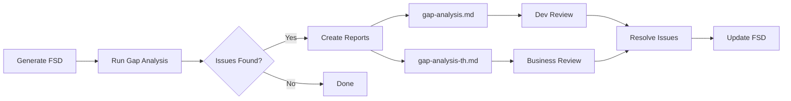

# Claude Code Instructions for [PROJECT_NAME]

## Project Overview

This project uses a Function Specification Design (FSD) documentation system to analyze and document codebase functionality, integrated with Speckit for feature specification and implementation tracking.

**Project Structure:**
```
[project-root]/
├── [source-code]/           # Your source code folders
├── docs/
│   ├── FSD_TASK_LIST.md     # Master tracking file
│   └── fsd/
│       ├── INSTRUCTIONS.md
│       ├── SPEC_TEMPLATE.md
│       ├── DISCREPANCIES_TEMPLATE.md
│       ├── DISCREPANCIES_TH_TEMPLATE.md
│       ├── RECONCILIATION_TEMPLATE.md
│       ├── GAP_ANALYSIS_INSTRUCTIONS.md
│       ├── GAP_ANALYSIS_TEMPLATE.md
│       ├── GAP_ANALYSIS_TH_TEMPLATE.md
│       └── module_XX_name/
│           ├── INDEX.md
│           ├── reconciliation/
│           │   ├── discrepancies.md
│           │   ├── discrepancies-th.md
│           │   ├── gap-analysis.md
│           │   └── gap-analysis-th.md
│           └── XX_submodule/
│               └── spec.md
├── .specify/
│   ├── memory/
│   │   └── constitution.md  # Project governance with FSD sync rules
│   └── templates/           # Speckit templates
└── resources/
    └── old-fsd/             # Old FSD documents (if any)
```

## Documentation Structure

FSD documentation follows this structure:

```
docs/
├── FSD_TASK_LIST.md              # Master tracking file

docs/fsd/
├── INSTRUCTIONS.md               # How to use the FSD system
├── SPEC_TEMPLATE.md              # Template for detailed specs
├── DISCREPANCIES_TEMPLATE.md     # Template for reconciliation discrepancies
├── DISCREPANCIES_TH_TEMPLATE.md  # Template for Thai Q&A version
├── RECONCILIATION_TEMPLATE.md    # Template for reconciliation tracking
├── GAP_ANALYSIS_INSTRUCTIONS.md  # Gap analysis instructions
├── GAP_ANALYSIS_TEMPLATE.md      # Gap analysis technical template
├── GAP_ANALYSIS_TH_TEMPLATE.md   # Gap analysis Thai template
├── MODULE_DEPENDENCY_MAP.md      # Cross-module dependency visualization
└── module_XX_name/               # Module folders with submodules
    ├── INDEX.md                  # Module tracking
    ├── reconciliation/           # Reconciliation & gap analysis
    │   ├── discrepancies.md
    │   ├── discrepancies-th.md
    │   ├── gap-analysis.md
    │   └── gap-analysis-th.md
    └── XX_submodule/
        └── spec.md               # Detailed specification
```

---

## Reconciliation with Old FSD

When comparing old FSD (in `resources/old-fsd/`) with code:

1. Use `DISCREPANCIES_TEMPLATE.md` to create technical discrepancy files
2. Use `DISCREPANCIES_TH_TEMPLATE.md` to create Thai Q&A version for business users
3. **Always generate BOTH files:**
   - `discrepancies.md` - Technical version with code evidence (for developers)
   - `discrepancies-th.md` - Thai Q&A version with checkboxes (for business users)
4. Add severity icons (🔴 High, 🟡 Medium, 🟢 Low)
5. Include sign-off section for approvers in Thai version

---

## IMPORTANT: Markdown Formatting Rules

### Tables Must Have Blank Line Before Them

**CRITICAL:** Always add a blank line before markdown tables, otherwise they won't render properly.

**WRONG:**
```markdown
**Key Endpoints:**
| Column | Column |
|--------|--------|
| data   | data   |
```

**CORRECT:**
```markdown
**Key Endpoints:**

| Column | Column |
|--------|--------|
| data   | data   |
```

This applies to ALL tables in markdown files.

---

## FSD Generation Guidelines

When generating FSD documentation:

1. **Use the template** - Copy from `docs/fsd/SPEC_TEMPLATE.md`

2. **Include all sections:**
   - User Stories with acceptance criteria (Given/When/Then)
   - Business Rules with error messages
   - API Specifications with request/response examples
   - Data Models with ERD diagrams
   - UI/UX layouts where applicable
   - Workflow diagrams (Mermaid)

3. **Update tracking files:**
   - Module's `INDEX.md` - Mark submodule progress
   - `FSD_TASK_LIST.md` - Update overall progress

4. **Use Mermaid for diagrams:**
   - `flowchart` for process flows
   - `erDiagram` for data models
   - `stateDiagram-v2` for state machines
   - `sequenceDiagram` for integrations

5. **Run Gap Analysis (after FSD generation):**
   - Analyze for documentation gaps and open questions
   - Generate `gap-analysis.md` in reconciliation folder
   - Generate `gap-analysis-th.md` for business stakeholders

---

## Code Analysis Commands

When analyzing code for FSD:

```bash
# Find all endpoints (adjust pattern for your framework)
grep -rn "route\|endpoint\|@Get\|@Post" src/

# Find model/class definitions
grep -rn "class\|interface\|type" src/

# Find function definitions
grep -rn "function\|def\|func" src/
```

---

## Restrictions

- Always check `docs/fsd/INSTRUCTIONS.md` before creating FSD documentation
- Do not run build or dev server commands unless explicitly requested
- [Add your project-specific restrictions here]

---

## Pending Tasks

The following items need to be configured for this project:

- [ ] **Project Name** - Replace `[PROJECT_NAME]` throughout documentation
- [ ] **Repository URL** - Add the repository URL to all FSD documentation files
- [ ] **Source Code Paths** - Configure paths to source code

---

## Git Submodules (if applicable)

This project may use git submodules for source code:

| Submodule | Path | Description |
|-----------|------|-------------|
| [submodule-name] | `[path]/` | [Description] |

**Source Code Paths:**

```
[source-path]/src/
├── controllers/    # REST controllers
├── services/       # Business logic
├── repositories/   # Data access
└── models/         # Data models
```

---

## Gap Analysis (Post-FSD Generation)

After generating FSD from source code, run gap analysis to detect issues, inconsistencies, and items needing business decisions.

### What Gap Analysis Detects

| Category | Description |
|----------|-------------|
| Documentation Gaps | Missing or incomplete sections |
| Open Questions | Unresolved business decisions |
| Inconsistencies | Conflicting information between modules |
| Complex Patterns | Unusual business logic needing attention |
| Quality Issues | TODOs, placeholders, formatting problems |

### When to Run

- After completing FSD generation for a module
- After significant code changes
- Before major releases
- During code audits

### Gap Analysis Workflow



### Claude Code Prompts

**Full Project Analysis:**
```
Analyze all FSD documentation in /docs/fsd/ for gaps, inconsistencies,
and unusual patterns. Use GAP_ANALYSIS_TEMPLATE.md for output.
Generate reports in each module's reconciliation folder.
```

**Single Module Analysis:**
```
Run gap analysis on Module XX [Name].
Generate gap-analysis.md in the reconciliation folder.
Include Thai summary in gap-analysis-th.md.
```

**Quick Health Check:**
```
Quick FSD health check - summarize:
1. Modules with open questions
2. Missing reconciliation files
3. TODOs and incomplete sections
```

### Severity Guidelines

| Severity | Icon | Criteria | Action Timeline |
|----------|------|----------|-----------------|
| Critical | 🔴 | Blocks work or affects production | Immediate |
| High | 🟠 | Significant workflow impact | Within sprint |
| Medium | 🟡 | Quality concern, has workarounds | Next sprint |
| Low | 🟢 | Minor improvement | Backlog |

---

## Testing Documentation

**IMPORTANT:** All testing documentation goes in `docs/test/`, NOT in `docs/fsd/`.

### Location Rules

| Documentation Type | Location | Template |
|-------------------|----------|----------|
| FSD Specifications | `docs/fsd/module_XX/` | `SPEC_TEMPLATE.md` |
| Gap Analysis | `docs/fsd/module_XX/reconciliation/` | `GAP_ANALYSIS_TEMPLATE.md` |
| Test Plans | `docs/test/backend/module_XX/` | `TEST_PLAN_TEMPLATE.md` |
| Integration Tests | `docs/test/backend/module_XX/` | `INTEGRATION_TEST_TEMPLATE.md` |
| E2E Tests | `docs/test/frontend_XX/` | `E2E_TEST_TEMPLATE.md` |
| QA Checklists | `docs/test/backend/module_XX/` | `QA_CHECKLIST_TEMPLATE.md` |

### Testing Documentation Structure

```
docs/test/
├── TESTING_INSTRUCTIONS.md      # How to create test documentation
├── TEST_PLAN_TEMPLATE.md        # Test plan template
├── INTEGRATION_TEST_TEMPLATE.md # Integration test template
├── E2E_TEST_TEMPLATE.md         # E2E test template
├── QA_CHECKLIST_TEMPLATE.md     # QA checklist template
├── backend/
│   └── module_XX_name/
│       ├── test_plan.md
│       ├── integration_tests.md
│       └── qa_checklist.md
├── frontend_backoffice/
│   ├── e2e_tests.md
│   └── qa_checklist.md
└── frontend_mobile/
    ├── e2e_tests.md
    └── qa_checklist.md
```

---

## Speckit Integration

This project uses Speckit for feature specification and implementation tracking.

### Key Commands

| Command | Purpose |
|---------|---------|
| `/speckit.specify` | Create feature specification |
| `/speckit.plan` | Generate implementation plan |
| `/speckit.tasks` | Generate task list |
| `/speckit.implement` | Execute implementation |
| `/speckit.analyze` | Run gap analysis |

### Constitution

The project constitution at `.specify/memory/constitution.md` defines governance rules including:

- **FSD-Speckit Bidirectional Sync**: Specs must reference FSD, implementations must update FSD
- **Documentation Traceability**: Clear links between spec → implementation → FSD
- **Single Source of Truth**: FSD is authoritative for existing business logic

### FSD Reference Requirement

Per the constitution, all Speckit specifications MUST:

1. Reference relevant FSD modules before implementation
2. Include "FSD Reference" section listing reviewed modules
3. Update FSD documentation after successful implementation
