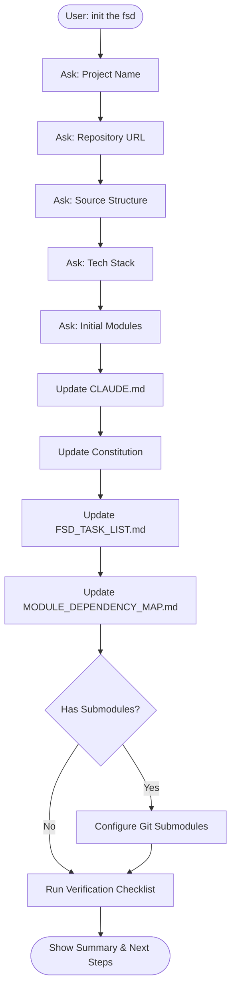

# FSD Skeleton Initialization Instructions

This document describes what happens when you run `init the fsd` (or `/init-fsd`) with Claude Code.

## Overview

The initialization process configures this FSD skeleton template for your specific project. It transforms generic placeholders into project-specific configurations.

## What Gets Configured

### 1. Project Identity

| File | What Changes |
|------|--------------|
| `CLAUDE.md` | Project name, source paths, restrictions |
| `.specify/memory/constitution.md` | Project name, ratification date |
| `docs/FSD_TASK_LIST.md` | Module list, priorities |
| `docs/fsd/MODULE_DEPENDENCY_MAP.md` | Module names, dependencies |

### 2. Source Code Configuration

If your project has source code (in this repo or submodules):

```
# Single repo
src/
├── controllers/
├── services/
└── models/

# Or with submodules
project-backend/     # git submodule
project-frontend/    # git submodule
```

### 3. Module Structure

The initialization creates your module list:

```
docs/fsd/
├── module_01_[name]/
│   ├── INDEX.md
│   └── reconciliation/
├── module_02_[name]/
│   ├── INDEX.md
│   └── reconciliation/
└── ...
```

## Initialization Flow



## Information Gathered

### Required Information

| Question | Purpose | Example |
|----------|---------|---------|
| Project Name | Used in titles and references | "MyApp", "E-Commerce Platform" |
| Repository URL | For Source Code Reference sections | "https://github.com/org/repo" |
| Tech Stack | Configures code analysis commands | "Kotlin/Spring Boot", "Node.js/Express" |

### Optional Information

| Question | Purpose | Example |
|----------|---------|---------|
| Submodule URLs | If using git submodules | Backend repo, Frontend repo |
| Module List | Pre-populate FSD task list | Authentication, Orders, Products |
| Priorities | Set initial priorities | HIGH, MEDIUM, LOW per module |

## Files Modified

### CLAUDE.md

Before:
```markdown
# Claude Code Instructions for [PROJECT_NAME]
```

After:
```markdown
# Claude Code Instructions for MyApp
```

### Constitution

Before:
```markdown
# [PROJECT_NAME] Constitution
**Version**: 1.0.0 | **Ratified**: [DATE] | **Last Amended**: [DATE]
```

After:
```markdown
# MyApp Constitution
**Version**: 1.0.0 | **Ratified**: 2025-12-06 | **Last Amended**: 2025-12-06
```

### FSD_TASK_LIST.md

Before:
```markdown
| # | Module | Status | Priority |
|---|--------|--------|----------|
| XX | [Module Name] | ⬜ Not Started | [PRIORITY] |
```

After:
```markdown
| # | Module | Status | Priority |
|---|--------|--------|----------|
| 01 | Authentication | ⬜ Not Started | HIGH |
| 02 | User Management | ⬜ Not Started | HIGH |
| 03 | Products | ⬜ Not Started | MEDIUM |
```

## Post-Initialization

After initialization is complete, you can:

### Start Creating FSD

```
Create FSD for Module 01: Authentication
Analyze the source code and generate documentation following SPEC_TEMPLATE.md
```

### Create a Feature Spec

```
/speckit.specify Add two-factor authentication to the login flow
```

### Check Progress

```
Show me the current FSD progress from FSD_TASK_LIST.md
```

## Verification Checklist

The initialization verifies:

- [ ] No `[PROJECT_NAME]` placeholders remain in CLAUDE.md
- [ ] No `[DATE]` placeholders remain in constitution
- [ ] FSD_TASK_LIST.md has at least one module
- [ ] MODULE_DEPENDENCY_MAP.md has been updated
- [ ] All required folders exist with .gitkeep files
- [ ] Constitution has today's date as ratification date

## Troubleshooting

### "I don't have source code yet"

That's fine! You can:
1. Initialize with placeholder modules
2. Skip submodule configuration
3. Add source code paths later when available

### "I want to change the module list later"

You can always:
1. Edit `docs/FSD_TASK_LIST.md` manually
2. Create new module folders in `docs/fsd/`
3. Update `MODULE_DEPENDENCY_MAP.md`

### "I need to re-run initialization"

Simply run `init the fsd` again. Claude will ask if you want to:
1. Start fresh (overwrite existing config)
2. Update specific sections only
3. Add new modules to existing list

## Related Commands

| Command | Purpose |
|---------|---------|
| `init the fsd` | Initial project setup |
| `/speckit.specify` | Create feature specification |
| `/speckit.plan` | Generate implementation plan |
| `/speckit.tasks` | Generate task list |
| `/speckit.analyze` | Run gap analysis |
