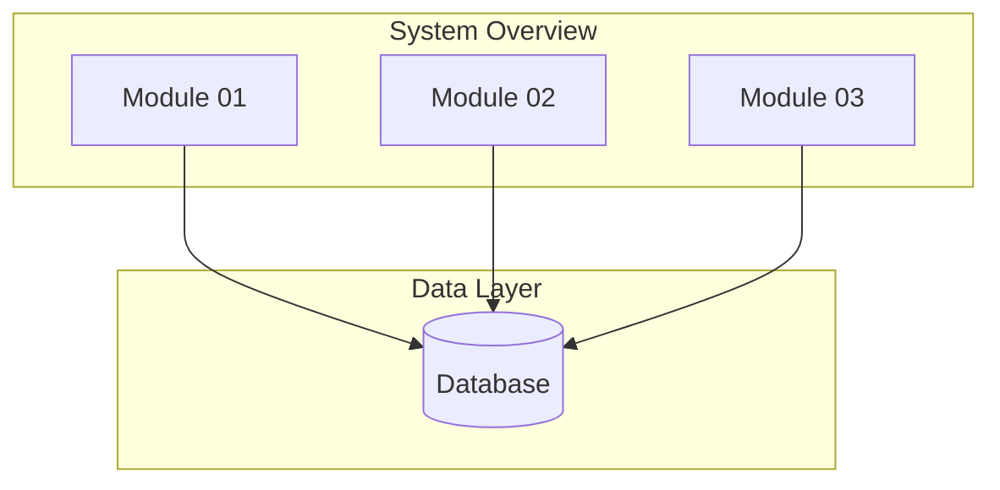
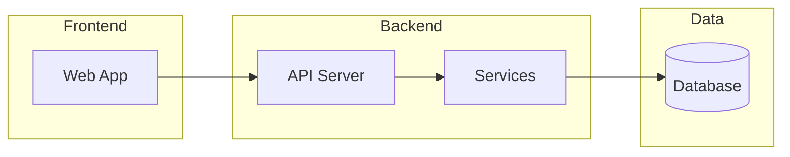

# Function Specification Design (FSD) - Task List

This document tracks the progress of creating detailed Function Specification Design documentation for all modules in [PROJECT_NAME].

**Last Updated:** YYYY-MM-DD
**Status:** ⬜ NOT STARTED - 0/X Modules

---

## Overview

[PROJECT_NAME] is [brief description of your project].

### Technology Stack

| Component | Technology |
|-----------|------------|
| Backend | [Technology] |
| Frontend | [Technology] |
| Database | [Technology] |
| [Other] | [Technology] |

### Codebase Statistics

| Repository | Controllers/Routes | Endpoints | Services | Models |
|------------|-------------------|-----------|----------|--------|
| [repo-name] | X | X | X | X |

---

## Module Documentation Status

### 1. [MODULE CATEGORY NAME]

#### 1.1 [Module Name]

**File:** `fsd/module_01_name/INDEX.md`
**Status:** ⬜ Not Started
**Priority:** HIGH | MEDIUM | LOW
**Controller/File:** `[source file path]`

**Components:**
- [Component 1]
- [Component 2]
- [Component 3]

**Key Endpoints/Functions:**

| Name | Type | Description |
|------|------|-------------|
| [Name] | GET/POST/Function | [Description] |

---

#### 1.2 [Module Name]

**File:** `fsd/module_02_name/INDEX.md`
**Status:** ⬜ Not Started
**Priority:** HIGH | MEDIUM | LOW

[Repeat for each module...]

---

## Progress Summary

**Total Modules:** X
**Completed:** 0 ✅
**In Progress:** 0 🔄
**Not Started:** X ⬜

**Progress:** 0% (0/X)

### Recent Activity

| Date | Module | Activity |
|------|--------|----------|
| YYYY-MM-DD | Module XX | Activity description |

---

### Modules by Priority:

#### HIGH Priority (X modules):

1. ⬜ module_01_name - [Description]
2. ⬜ module_02_name - [Description]

#### MEDIUM Priority (X modules):

3. ⬜ module_03_name - [Description]

#### LOW Priority (X modules):

4. ⬜ module_04_name - [Description]

---

## Architecture Diagrams

### System Architecture

---

## Documentation Guidelines

Each module FSD document should include:

1. **Module Overview** - Purpose, scope, stakeholders
2. **Architecture** - Component diagram (Mermaid), data flow, dependencies
3. **Functional Requirements** - Use cases, user stories, business rules
4. **Technical Specifications** - Classes, methods, parameters with file:line references
5. **API Specifications** - Endpoints, request/response formats, error codes
6. **Data Models** - Entity relationships (Mermaid ERD), field definitions
7. **Business Logic** - Algorithms, decision trees (Mermaid), state machines
8. **Integration Specifications** - External API mappings, authentication flows
9. **Configuration** - AppSettings, environment variables
10. **Testing Requirements** - Unit/integration test scenarios
11. **Error Handling** - Error scenarios, logging requirements
12. **Performance Considerations** - Caching, optimization
13. **Security Considerations** - Authentication, authorization, data protection

---

## Next Steps

1. ⬜ Scan and document codebase structure
2. ⬜ Begin with HIGH priority modules
3. ⬜ Create detailed FSD documents following the template
4. ⬜ Cross-reference between related modules
5. ⬜ Review and iterate on each document

---

## Notes

- [Add project-specific notes here]
