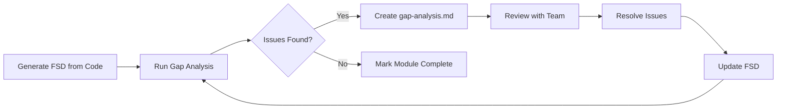

# FSD Gap Analysis Instructions

This document provides guidelines for detecting gaps, inconsistencies, and unusual patterns in FSD documentation generated from source code.

---

## 1. Purpose

Gap Analysis helps identify:

- **Documentation Gaps** - Missing or incomplete sections
- **Open Questions** - Unresolved business decisions
- **Inconsistencies** - Conflicting information between modules
- **Unusual Patterns** - Complex business logic that needs attention
- **Quality Issues** - Formatting problems, placeholder text, TODOs

---

## 2. Output Files

Gap analysis generates files in each module's reconciliation folder:

```
docs/fsd/
├── GAP_ANALYSIS_INSTRUCTIONS.md    # This file
├── GAP_ANALYSIS_TEMPLATE.md        # Template for analysis output
├── GAP_ANALYSIS_TH_TEMPLATE.md     # Thai summary template
│
└── module_XX_name/
    └── reconciliation/
        ├── gap-analysis.md         # Technical analysis output
        └── gap-analysis-th.md      # Thai summary for business users
```

---

## 3. When to Run Gap Analysis

Run gap analysis:

- After completing FSD documentation for a module
- After significant code changes
- Before major releases
- When onboarding new team members
- During code audits or reviews

---

## 4. Claude Code Prompts

### Full Project Analysis

```
Analyze all FSD documentation in /docs/fsd/ for gaps, inconsistencies,
and unusual patterns. Generate a comprehensive report.
```

### Single Module Analysis

```
Analyze Module XX [Name] FSD for gaps and issues.
Check:
1. Documentation completeness
2. Open questions needing business decisions
3. Unusual business logic patterns
4. Inconsistencies with other modules
Generate gap-analysis.md in the reconciliation folder.
```

### Quick Health Check

```
Quick FSD health check - summarize:
1. Modules with open questions
2. Missing reconciliation files
3. TODOs and incomplete sections
```

### Generate Thai Summary

```
Generate Thai gap analysis summary for Module XX.
Focus on items needing business decisions.
Output to gap-analysis-th.md for business stakeholders.
```

---

## 5. Analysis Categories

### 5.1 Documentation Completeness

| Check | Description |
|-------|-------------|
| Sections Present | All template sections exist |
| Content Filled | No empty sections or placeholder text |
| Diagrams Included | Mermaid diagrams where appropriate |
| Examples Provided | Request/response examples in API specs |

### 5.2 Open Questions

| Severity | Icon | Criteria |
|----------|------|----------|
| Critical | 🔴 | Blocks development or affects core functionality |
| Important | 🟡 | Affects user workflow, needs decision before release |
| Minor | 🟢 | Nice-to-have clarification, can defer |

### 5.3 Business Logic Patterns

| Pattern Type | Description | Action |
|--------------|-------------|--------|
| Complex | Multi-step workflows, state machines | Document thoroughly |
| Unusual | Non-standard approaches | Verify intentional |
| Risk-prone | Security, data integrity concerns | Review with team |
| Performance | Large-scale operations, async processing | Monitor and optimize |

### 5.4 Quality Issues

| Issue Type | Example |
|------------|---------|
| Formatting | Tables without blank lines, broken markdown |
| Placeholders | `XXX`, `TODO`, `[TBD]` in content |
| Inconsistency | Different naming conventions between modules |
| Incomplete | Missing error codes, empty business rules |

---

## 6. Analysis Process

### Step 1: Scope Definition

```bash
# Define what to analyze
- Single module: module_XX_name
- Multiple modules: module_01, module_02, module_03
- Full project: all modules in docs/fsd/
```

### Step 2: Documentation Review

Check each module for:

```markdown
- [ ] INDEX.md exists and is complete
- [ ] All submodules listed have spec.md files
- [ ] All sections from SPEC_TEMPLATE.md are present
- [ ] No placeholder text remains
- [ ] Mermaid diagrams render correctly
```

### Step 3: Open Questions Collection

Search for patterns indicating unresolved decisions:

```bash
# Common patterns to search
- "Open question"
- "TODO"
- "TBD"
- "needs decision"
- "pending"
- "to be determined"
- "unclear"
- "confirm with"
```

### Step 4: Cross-Module Consistency

Compare between modules:

```markdown
- [ ] Naming conventions consistent
- [ ] Status values align
- [ ] Error code formats match
- [ ] API patterns similar
- [ ] Integration points documented both sides
```

### Step 5: Pattern Detection

Identify complex business logic:

```markdown
- State machines (multiple status transitions)
- Reservation/locking mechanisms
- Async/batch processing
- Multi-step workflows
- Cross-module dependencies
```

### Step 6: Generate Report

Use `GAP_ANALYSIS_TEMPLATE.md` to create output:

```bash
# Create output files
docs/fsd/module_XX_name/reconciliation/gap-analysis.md
docs/fsd/module_XX_name/reconciliation/gap-analysis-th.md
```

---

## 7. Output Format

### Technical Report (gap-analysis.md)

Contains:

- Executive summary with metrics
- Detailed findings by category
- Severity ratings
- Code/spec references
- Recommended actions

### Thai Summary (gap-analysis-th.md)

Contains:

- Simple summary in Thai
- Questions needing business input
- Checkbox format for decisions
- Sign-off section

---

## 8. Severity Guidelines

| Severity | Icon | Impact | Action Timeline |
|----------|------|--------|-----------------|
| Critical | 🔴 | Blocks work or affects production | Immediate |
| High | 🟠 | Significant workflow impact | Within sprint |
| Medium | 🟡 | Quality concern, has workarounds | Next sprint |
| Low | 🟢 | Minor improvement, documentation gap | Backlog |

---

## 9. Follow-up Actions

After gap analysis:

1. **Critical Issues** - Create tickets, assign owners
2. **Open Questions** - Schedule business review meeting
3. **Quality Issues** - Add to tech debt backlog
4. **Documentation Gaps** - Update specs immediately

---

## 10. Integration with FSD Workflow



---

## 11. Example Analysis Output

See `GAP_ANALYSIS_TEMPLATE.md` for the full template.

Quick example:

```markdown
## Module 04: Vouchers - Gap Analysis

### Summary
| Metric | Value |
|--------|-------|
| Completeness | 95% |
| Open Questions | 3 |
| Critical Issues | 0 |

### Open Questions
1. 🟡 Campaign limit validation - should we allow 0?
2. 🟡 Code length - min/max values needed
3. 🟢 Expiry date format preference
```

---

## 12. Maintenance

- Run gap analysis quarterly or after major changes
- Archive old reports in `/reconciliation/archive/`
- Update templates as project evolves

---

*Last Updated: 2025-12-05*
