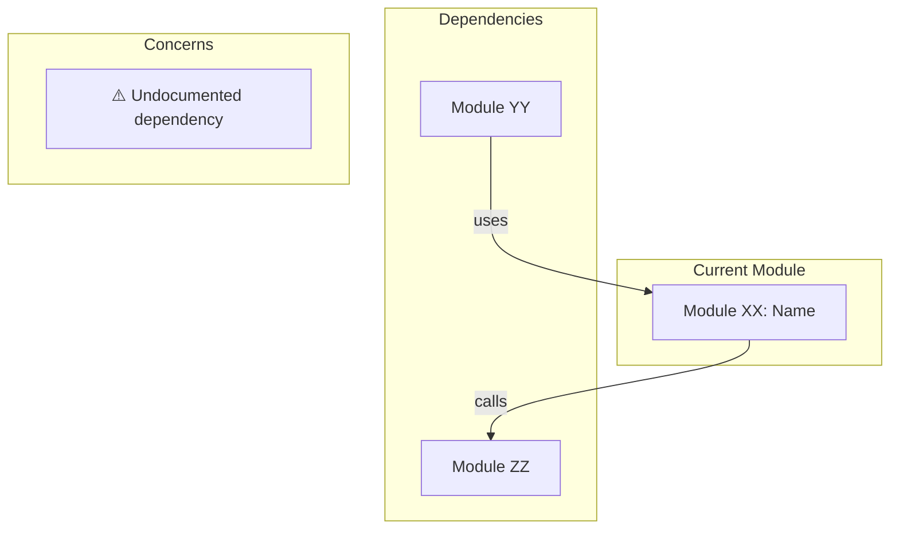

# Module XX: [Module Name] - Gap Analysis Report

---

## Executive Summary

| Metric | Value |
|--------|-------|
| Analysis Date | YYYY-MM-DD |
| Module | [Module Name] (MOD-XX) |
| FSD Location | `docs/fsd/module_XX_name/` |
| Source Code | `[source folder path]` |
| Overall Health | 🟢 Good / 🟡 Needs Attention / 🔴 Critical Issues |

---

## Source Code Reference

> **Purpose:** This section tracks which version of the source code was used for this gap analysis.
> When code changes, compare against this reference to identify what needs re-analysis.

| Field | Value |
|-------|-------|
| Repository | `[repository-url]` |
| Branch | `[branch-name]` |
| Commit Hash | `[full-commit-hash]` |
| Commit Date | `[YYYY-MM-DD HH:MM:SS]` |
| Commit Message | `[commit-message-summary]` |

**Files Analyzed:**

```
[List the source code files that were analyzed]
- src/path/to/file1.ts
- src/path/to/file2.ts
```

**How to check for updates:**

```bash
# View commits since this reference
git log [commit-hash]..HEAD --oneline -- [relevant-paths]

# View detailed changes since reference
git diff [commit-hash]..HEAD -- [relevant-paths]
```

---

### Quick Stats

| Category | Count | Critical | Needs Decision |
|----------|-------|----------|----------------|
| Documentation Gaps | 0 | 0 | 0 |
| Open Questions | 0 | 0 | 0 |
| Inconsistencies | 0 | 0 | 0 |
| Complex Patterns | 0 | - | 0 |
| Quality Issues | 0 | 0 | 0 |
| **Total** | **0** | **0** | **0** |

---

## Action Required Summary

| # | Issue | Severity | Owner | Status |
|---|-------|----------|-------|--------|
| GAP-001 | [Brief description] | 🔴 Critical | [TBD] | Open |
| GAP-002 | [Brief description] | 🟡 Medium | [TBD] | Open |
| GAP-003 | [Brief description] | 🟢 Low | [TBD] | Open |

---

## 1. Documentation Completeness

### 1.1 Section Checklist

| Section | Status | Notes |
|---------|--------|-------|
| Overview | ✅ Complete / ⚠️ Partial / ❌ Missing | |
| User Stories | ✅ / ⚠️ / ❌ | |
| Business Rules | ✅ / ⚠️ / ❌ | |
| Data Model | ✅ / ⚠️ / ❌ | |
| API Specifications | ✅ / ⚠️ / ❌ | |
| Error Handling | ✅ / ⚠️ / ❌ | |
| Security Considerations | ✅ / ⚠️ / ❌ | |
| Integration Points | ✅ / ⚠️ / ❌ | |
| Testing Requirements | ✅ / ⚠️ / ❌ | |
| Configuration | ✅ / ⚠️ / ❌ | |

### 1.2 Missing Documentation

#### GAP-DOC-001: [Title]

| Field | Value |
|-------|-------|
| Severity | 🔴 Critical / 🟠 High / 🟡 Medium / 🟢 Low |
| Location | `docs/fsd/module_XX/[submodule]/spec.md` |
| Section | [Section name] |

**Description:**

[What is missing or incomplete]

**Impact:**

- [ ] Blocks development
- [ ] Affects understanding
- [ ] Documentation only

**Recommended Action:**

[What needs to be done to resolve]

---

## 2. Open Questions

### Summary

| ID | Question | Severity | Category | Status |
|----|----------|----------|----------|--------|
| OQ-001 | [Brief question] | 🔴 | Business Rule | Open |
| OQ-002 | [Brief question] | 🟡 | Technical | Open |
| OQ-003 | [Brief question] | 🟢 | UX/UI | Open |

### OQ-001: [Question Title]

| Field | Value |
|-------|-------|
| Severity | 🔴 Critical / 🟠 High / 🟡 Medium / 🟢 Low |
| Category | Business Rule / Technical / UX/UI / Integration / Security |
| Found In | `docs/fsd/module_XX/[file].md:line` |
| Status | Open / In Review / Resolved |

**Original Text:**

> "[Quote from FSD where question was found]"

**Question:**

[Clear statement of what needs to be decided]

**Options:**

- [ ] Option A: [Description and implications]
- [ ] Option B: [Description and implications]
- [ ] Option C: [Description and implications]

**Stakeholders to Consult:**

- [ ] [Role/Name 1]
- [ ] [Role/Name 2]

---

### 📝 OQ-001: Business Response

| Field | Response |
|-------|----------|
| Decided By | _[Name/Role]_ |
| Decision Date | _[YYYY-MM-DD]_ |
| Decision | _[Selected option]_ |

**Rationale:**

```
[Explanation of why this decision was made]
```

---

## 3. Inconsistencies

### 3.1 Cross-Module Inconsistencies

| ID | Issue | Modules Affected | Severity |
|----|-------|-----------------|----------|
| INC-001 | [Description] | Module A, Module B | 🟡 |

#### INC-001: [Inconsistency Title]

**Description:**

[What is inconsistent between modules]

**Module A Says:**

- File: `docs/fsd/module_A/[file].md:line`
- Content: "[Quote]"

**Module B Says:**

- File: `docs/fsd/module_B/[file].md:line`
- Content: "[Quote]"

**Recommended Resolution:**

- [ ] Update Module A to match Module B
- [ ] Update Module B to match Module A
- [ ] Both need updating - correct value is: [value]

---

### 3.2 Internal Inconsistencies

| ID | Issue | Location | Severity |
|----|-------|----------|----------|
| INC-INT-001 | [Description] | [File] | 🟡 |

---

## 4. Complex Business Patterns

### Summary

| Pattern | Complexity | Risk Level | Documentation Quality |
|---------|------------|------------|----------------------|
| [Pattern Name] | HIGH/MEDIUM/LOW | 🔴/🟡/🟢 | Good/Needs Improvement |

### PATTERN-001: [Pattern Name]

| Field | Value |
|-------|-------|
| Complexity | HIGH / MEDIUM / LOW |
| Risk Level | 🔴 High / 🟡 Medium / 🟢 Low |
| Module(s) | [Module names] |
| Documentation | Good / Needs Improvement / Missing |

**Description:**

[What this pattern does and why it's notable]

**Key Components:**

1. [Component 1] - [Brief description]
2. [Component 2] - [Brief description]
3. [Component 3] - [Brief description]

**Potential Concerns:**

- [ ] [Concern 1]
- [ ] [Concern 2]

**Recommendations:**

- [ ] [Action item 1]
- [ ] [Action item 2]

---

## 5. Quality Issues

### 5.1 Formatting Issues

| ID | Issue | File | Line | Severity |
|----|-------|------|------|----------|
| QA-FMT-001 | [Description] | [file.md] | [line] | 🟢 |

### 5.2 Placeholder Text Found

| ID | Placeholder | File | Line |
|----|-------------|------|------|
| QA-PH-001 | `TODO: [text]` | [file.md] | [line] |
| QA-PH-002 | `XXX` | [file.md] | [line] |
| QA-PH-003 | `[TBD]` | [file.md] | [line] |

### 5.3 Missing Diagrams

| ID | Diagram Type | Location | Priority |
|----|--------------|----------|----------|
| QA-DIA-001 | ERD | [section] | 🟡 |
| QA-DIA-002 | Flowchart | [section] | 🟢 |

---

## 6. Module Dependencies



### Dependency Issues

| From | To | Issue | Severity |
|------|----|-------|----------|
| Module XX | Module YY | [Description] | 🟡 |

---

## 7. Recommendations

### Immediate Actions (Critical)

| # | Action | Owner | Due Date |
|---|--------|-------|----------|
| 1 | [Action description] | [TBD] | [TBD] |

### Short-term Actions (This Sprint)

| # | Action | Owner | Due Date |
|---|--------|-------|----------|
| 1 | [Action description] | [TBD] | [TBD] |

### Long-term Actions (Backlog)

| # | Action | Priority |
|---|--------|----------|
| 1 | [Action description] | Medium |

---

## 8. Analysis Metadata

| Field | Value |
|-------|-------|
| Analysis Tool | Claude Code |
| Analysis Date | YYYY-MM-DD |
| Files Analyzed | [count] |
| Lines Reviewed | [count] |
| Time Taken | [duration] |

### Files Included in Analysis

```
docs/fsd/module_XX_name/
├── INDEX.md
├── reconciliation/
│   └── (this file)
├── 01_submodule/
│   └── spec.md
├── 02_submodule/
│   └── spec.md
└── ...
```

---

## Change Log

| Date | Author | Changes |
|------|--------|---------|
| YYYY-MM-DD | [Name/Claude Code] | Initial gap analysis |

---

*Generated by Claude Code*
*Template Version: 1.0*
