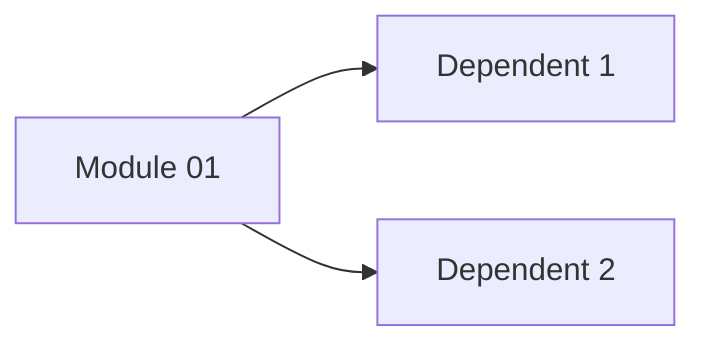
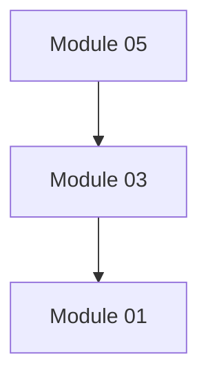
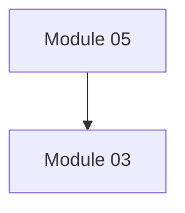

# [PROJECT_NAME] Module Dependency Map

**Version:** 1.0
**Last Updated:** [DATE]

---

## Overview

This document provides a comprehensive view of all module dependencies in the [PROJECT_NAME] system. Use this map to understand how modules interact and to assess the impact of changes.

---

## Full System Dependency Diagram

```mermaid
flowchart TB
    subgraph Core["Core Foundation"]
        MOD01[Module 01<br/>[Name]]
        MOD02[Module 02<br/>[Name]]
    end

    subgraph Business["Business Operations"]
        MOD03[Module 03<br/>[Name]]
        MOD04[Module 04<br/>[Name]]
    end

    subgraph Support["Support Services"]
        MOD05[Module 05<br/>[Name]]
    end

    %% Define dependencies
    MOD03 --> MOD01
    MOD04 --> MOD01
    MOD05 --> MOD03
```

---

## Module Index

| # | Module | Status | Dependencies | Dependents |
|---|--------|--------|--------------|------------|
| 01 | [Module Name](./module_01_name/INDEX.md) | ⬜ Not Started | None | [list] |
| 02 | [Module Name](./module_02_name/INDEX.md) | ⬜ Not Started | Module 01 | [list] |
| 03 | [Module Name](./module_03_name/INDEX.md) | ⬜ Not Started | Module 01 | [list] |
| 04 | [Module Name](./module_04_name/INDEX.md) | ⬜ Not Started | Module 01, 02 | [list] |
| 05 | [Module Name](./module_05_name/INDEX.md) | ⬜ Not Started | Module 03 | None |

---

## Dependency Categories

### 1. Core Foundation Modules

These modules form the foundation of the system. Changes here have wide-reaching impacts.

#### Module 01: [Name]

**Impact Level:** 🔴 Critical

[Description of why this module is foundational]



**Dependents:** [List modules that depend on this one]

---

### 2. Business Operation Modules

These modules handle core business functionality.

#### Module 03: [Name]

**Impact Level:** 🟠 High



---

### 3. Support Service Modules

These modules provide supporting functionality.

#### Module 05: [Name]

**Impact Level:** 🟢 Low



---

## Impact Analysis Matrix

Use this matrix to assess the impact of changes to any module.

| Changed Module | Affects Modules |
|----------------|-----------------|
| 01 [Name] | All dependent modules |
| 02 [Name] | [List] |
| 03 [Name] | [List] |
| 04 [Name] | [List] |
| 05 [Name] | None |

---

## Change Impact Guidelines

### 🔴 Critical Changes (Require Full Regression)

- [Core module] mechanism changes
- Entity structure changes
- Shared utility changes

### 🟠 High Impact Changes (Require Module + Dependent Testing)

- Business logic changes
- API contract changes
- Data model changes

### 🟡 Medium Impact Changes (Require Module Testing)

- Internal implementation changes
- Configuration changes

### 🟢 Low Impact Changes (Localized Testing)

- UI-specific changes
- Documentation updates
- Non-structural enhancements

---

## Quick Reference Links

### By Module Number

- [01 - [Name]](./module_01_name/INDEX.md)
- [02 - [Name]](./module_02_name/INDEX.md)
- [03 - [Name]](./module_03_name/INDEX.md)
- [04 - [Name]](./module_04_name/INDEX.md)
- [05 - [Name]](./module_05_name/INDEX.md)

---

## Change Log

| Version | Date | Author | Changes |
|---------|------|--------|---------|
| 1.0 | [DATE] | [Author] | Initial dependency map creation |
