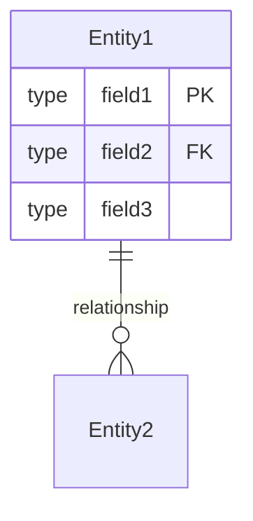
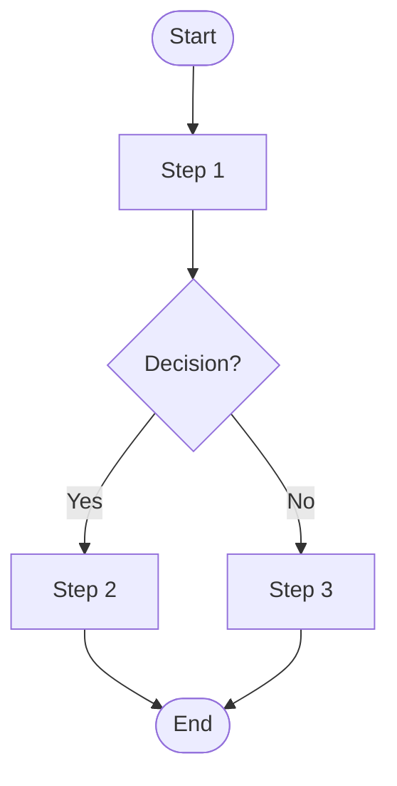

# Spec Template

**Module:** [Module Name]
**Submodule:** [Submodule Name]
**Version:** 1.0
**Status:** Draft | In Review | Approved
**Last Updated:** YYYY-MM-DD
**Author:** [Name]

---

## Source Code Reference

> **Purpose:** This section tracks which version of the source code was used to generate this FSD.
> When code changes, compare against this reference to identify what needs updating.

| Field | Value |
|-------|-------|
| Repository | `[repository-url]` |
| Branch | `[branch-name]` |
| Commit Hash | `[full-commit-hash]` |
| Commit Date | `[YYYY-MM-DD HH:MM:SS]` |
| Commit Message | `[commit-message-summary]` |

**Files Analyzed:**

```
[List the source code files that were analyzed to create this spec]
- src/path/to/file1.ts
- src/path/to/file2.ts
```

**How to check for updates:**

```bash
# View commits since this reference
git log [commit-hash]..HEAD --oneline -- [relevant-paths]

# View detailed changes since reference
git diff [commit-hash]..HEAD -- [relevant-paths]

# View what changed in specific files
git diff [commit-hash]..HEAD -- src/path/to/file.ts
```

---

## 1. Overview

### 1.1 Purpose

[Brief description of what this submodule does and why it exists]

### 1.2 Scope

**In Scope:**

- [Feature 1]
- [Feature 2]

**Out of Scope:**

- [Feature that is NOT included]

### 1.3 Actors

| Actor | Description |
|-------|-------------|
| [Role] | [What this actor does with this feature] |

---

## 2. User Stories

### US-001: [Story Title]

**As a** [actor/role]
**I want to** [action/goal]
**So that** [benefit/value]

**Acceptance Criteria:**

- [ ] Given [precondition], when [action], then [expected result]
- [ ] Given [precondition], when [action], then [expected result]

**Priority:** HIGH | MEDIUM | LOW
**Story Points:** [1-13]

---

### US-002: [Story Title]

**As a** [actor/role]
**I want to** [action/goal]
**So that** [benefit/value]

**Acceptance Criteria:**

- [ ] Given [precondition], when [action], then [expected result]

**Priority:** HIGH | MEDIUM | LOW
**Story Points:** [1-13]

---

## 3. Business Rules

### BR-001: [Rule Name]

**Description:** [What the rule enforces]
**Condition:** [When this rule applies]
**Action:** [What happens when rule is triggered]
**Error Message:** [Message shown to user if rule is violated]

---

### BR-002: [Rule Name]

**Description:** [What the rule enforces]
**Condition:** [When this rule applies]
**Action:** [What happens when rule is triggered]

---

## 4. Data Model

### 4.1 Entity Diagram



### 4.2 Field Specifications

#### [Entity Name]

| Field | Type | Required | Default | Description |
|-------|------|----------|---------|-------------|
| [field] | [type] | Yes/No | [value] | [description] |

---

## 5. API Specifications

### 5.1 [Endpoint Name]

**Endpoint:** `[METHOD] /path/action`
**Authorization:** Required
**Description:** [What this endpoint does]

**Request:**

```json
{
  "field1": "value",
  "field2": 123
}
```

**Response (Success):**

```json
{
  "success": true,
  "message": "Success message",
  "data": { }
}
```

**Response (Error):**

```json
{
  "success": false,
  "message": "Error description"
}
```

**Validation Rules:**

- [field]: [validation rule]

---

## 6. UI/UX Specifications

### 6.1 Screen: [Screen Name]

**Purpose:** [What user accomplishes on this screen]
**Entry Point:** [How user navigates here]
**Exit Points:** [Where user can go from here]

**Layout:**

```
+------------------------------------------+
|  Header                                  |
+------------------------------------------+
|  [Component 1]    |  [Component 2]       |
|                   |                      |
+------------------------------------------+
|  [Actions: Save] [Cancel]                |
+------------------------------------------+
```

**Fields:**

| Field | Type | Required | Validation | Default |
|-------|------|----------|------------|---------|
| [field] | Text/Select/Date | Yes/No | [rules] | [value] |

**Actions:**

| Action | Trigger | Behavior |
|--------|---------|----------|
| Save | Click button | Validate form, call API, show success/error |

---

## 7. Workflow / Process Flow



### 7.1 Process Steps

| Step | Actor | Action | System Response |
|------|-------|--------|-----------------|
| 1 | [Role] | [Action] | [Response] |

---

## 8. Error Handling

| Error Code | Condition | Message | Resolution |
|------------|-----------|---------|------------|
| ERR-001 | [Condition] | [Error message] | [How to fix] |

---

## 9. Security & Permissions

### 9.1 Required Permissions

| Permission | Description |
|------------|-------------|
| [permission.code] | [What it allows] |

### 9.2 Data Access Rules

- [Rule 1]
- [Rule 2]

---

## 10. Integration Points

| System | Direction | Purpose | Protocol |
|--------|-----------|---------|----------|
| [System] | Inbound/Outbound | [Purpose] | REST/API/etc |

---

## 11. Testing Scenarios

### TS-001: [Scenario Name]

**Preconditions:** [Setup required]
**Steps:**

1. [Step 1]
2. [Step 2]

**Expected Result:** [What should happen]

---

## 12. Non-Functional Requirements

| Requirement | Target | Measurement |
|-------------|--------|-------------|
| Response Time | < 2 seconds | API response time |
| Availability | 99.9% | Uptime |

---

## 13. Open Questions / TBD

| # | Question | Status | Decision |
|---|----------|--------|----------|
| 1 | [Question] | Open/Resolved | [Answer] |

---

## 14. Related Documentation

### 14.1 Related Modules

<!-- Link to other module INDEX.md files that this spec depends on or integrates with -->

| Module | Relationship | Description |
|--------|--------------|-------------|
| [Module 01: Authentication](../module_01_authentication/INDEX.md) | Dependency | [How this module uses authentication] |
| [Module XX: Name](../module_XX_name/INDEX.md) | Integration | [How modules interact] |

### 14.2 Related Specs

<!-- Link to specific spec.md files for detailed integration points -->

- [Submodule Name](../module_XX_name/XX_submodule/spec.md) - [Brief description of relationship]

### 14.3 Upstream Dependencies

<!-- Modules this spec DEPENDS ON (calls/uses) -->

| Module | Purpose | Integration Point |
|--------|---------|-------------------|
| [Module Name] | [Why needed] | [API/Service/Data used] |

### 14.4 Downstream Consumers

<!-- Modules that DEPEND ON this spec (are called by/use) -->

| Module | Purpose | Integration Point |
|--------|---------|-------------------|
| [Module Name] | [Why they need this] | [API/Service/Data provided] |

---

## 15. Change Log

| Version | Date | Author | Changes |
|---------|------|--------|---------|
| 1.0 | YYYY-MM-DD | [Name] | Initial draft |
