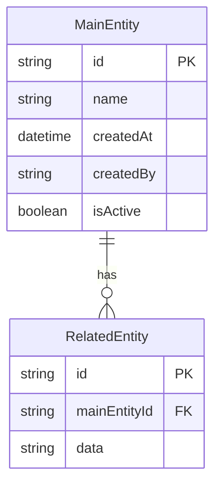
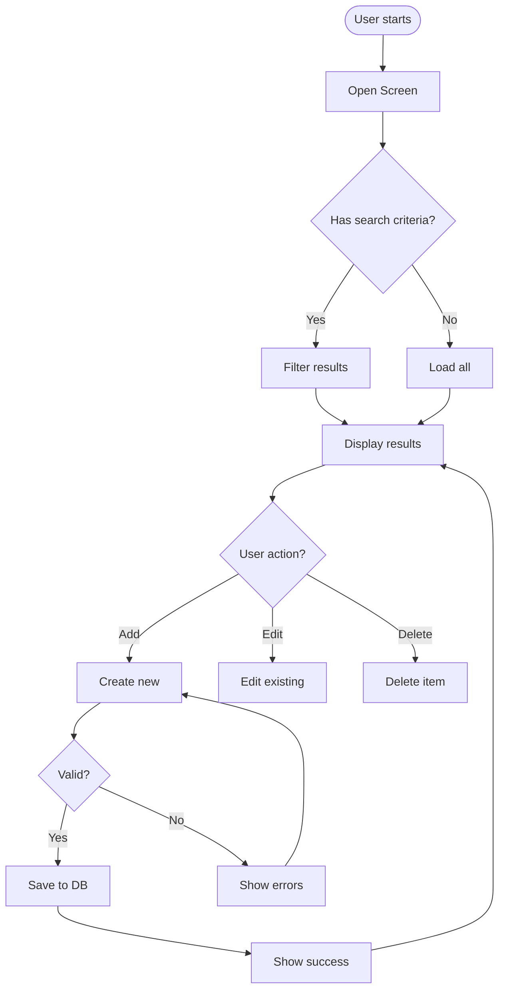

# Module XX: [Module Name] - Submodule 01: [Submodule Name]

**Module:** [Module Name]
**Submodule:** [Submodule Name]
**Version:** 1.0
**Status:** Draft
**Last Updated:** YYYY-MM-DD
**Author:** [Name/Claude Code]

---

## 1. Overview

### 1.1 Purpose

[This submodule handles... brief description of what it does and why it exists]

### 1.2 Scope

**In Scope:**

- [Feature 1]
- [Feature 2]
- [Feature 3]

**Out of Scope:**

- [Feature that belongs to another submodule]

### 1.3 Actors

| Actor | Description |
|-------|-------------|
| [Role 1] | [What this actor does with this feature] |
| [Role 2] | [What this actor does with this feature] |
| System | [Automated processes] |

---

## 2. User Stories

### US-001: [Primary User Action]

**As a** [role]
**I want to** [action]
**So that** [business value]

**Acceptance Criteria:**

- [ ] Given [precondition], when [action], then [result]
- [ ] Given [precondition], when [action], then [result]
- [ ] Given [edge case], when [action], then [proper handling]

**Priority:** HIGH
**Story Points:** 5

---

### US-002: [Secondary User Action]

**As a** [role]
**I want to** [action]
**So that** [business value]

**Acceptance Criteria:**

- [ ] Given [precondition], when [action], then [result]

**Priority:** MEDIUM
**Story Points:** 3

---

## 3. Business Rules

### BR-001: [Validation Rule]

**Description:** [What the rule enforces]
**Condition:** [When this rule applies]
**Action:** [What happens when rule is triggered]
**Error Message:** "[User-facing error message]"

---

### BR-002: [Business Logic Rule]

**Description:** [What the rule enforces]
**Condition:** [When this rule applies]
**Action:** [What happens]

---

## 4. Data Model

### 4.1 Entity Diagram



### 4.2 Field Specifications

#### MainEntity

| Field | Type | Required | Default | Description |
|-------|------|----------|---------|-------------|
| id | string | Yes | UUID | Primary key |
| name | string | Yes | - | [Description] |
| createdAt | datetime | Yes | now() | Creation timestamp |
| createdBy | string | Yes | current_user | Creator ID |
| isActive | boolean | Yes | true | Active status |

---

## 5. API Specifications

### 5.1 Create [Entity]

**Endpoint:** `POST /api/[module]/create`
**Authorization:** Required - [Permission]
**Description:** Creates a new [entity]

**Request:**

```json
{
  "name": "Example Name",
  "field2": "value",
  "field3": 123
}
```

**Response (Success - 200):**

```json
{
  "success": true,
  "message": "Created successfully",
  "data": {
    "id": "uuid-here",
    "name": "Example Name",
    "createdAt": "2024-01-15T10:30:00Z"
  }
}
```

**Response (Error - 400):**

```json
{
  "success": false,
  "message": "Validation error",
  "errors": [
    { "field": "name", "message": "Name is required" }
  ]
}
```

**Validation Rules:**

- `name`: Required, max 100 characters
- `field2`: Optional, must be valid format

---

### 5.2 Get [Entity] List

**Endpoint:** `GET /api/[module]/list`
**Authorization:** Required
**Description:** Retrieves list of [entities]

**Query Parameters:**

| Parameter | Type | Required | Description |
|-----------|------|----------|-------------|
| page | number | No | Page number (default: 1) |
| limit | number | No | Items per page (default: 20) |
| search | string | No | Search term |

**Response (Success):**

```json
{
  "success": true,
  "data": [
    { "id": "1", "name": "Item 1" },
    { "id": "2", "name": "Item 2" }
  ],
  "pagination": {
    "page": 1,
    "limit": 20,
    "total": 100
  }
}
```

---

## 6. UI/UX Specifications

### 6.1 Screen: [Main Screen Name]

**Purpose:** [What user accomplishes]
**Entry Point:** [Navigation path]
**Exit Points:** [Where user can go]

**Layout:**

```
+--------------------------------------------------+
|  Header / Navigation                             |
+--------------------------------------------------+
|  [Search Bar]                      [+ Add Button]|
+--------------------------------------------------+
|  Data Grid / List                                |
|  +--------------------------------------------+  |
|  | Column 1 | Column 2 | Column 3 | Actions  |  |
|  |----------|----------|----------|----------|  |
|  | Data     | Data     | Data     | Edit/Del |  |
|  +--------------------------------------------+  |
+--------------------------------------------------+
|  Pagination                                      |
+--------------------------------------------------+
```

**Fields:**

| Field | Type | Required | Validation | Default |
|-------|------|----------|------------|---------|
| Name | Text Input | Yes | Max 100 chars | - |
| Type | Dropdown | Yes | Must select | First option |
| Date | Date Picker | No | Not future | Today |

**Actions:**

| Action | Trigger | Behavior |
|--------|---------|----------|
| Add | Click + button | Open create modal |
| Edit | Click edit icon | Open edit modal |
| Delete | Click delete icon | Confirm then delete |
| Search | Type + Enter | Filter list |

---

## 7. Workflow / Process Flow



---

## 8. Error Handling

| Error Code | Condition | Message | Resolution |
|------------|-----------|---------|------------|
| ERR-001 | Required field empty | "Field [name] is required" | Fill in the field |
| ERR-002 | Duplicate entry | "This [entity] already exists" | Use different value |
| ERR-003 | Permission denied | "You don't have permission" | Contact admin |
| ERR-004 | Not found | "[Entity] not found" | Verify ID exists |

---

## 9. Security & Permissions

### 9.1 Required Permissions

| Permission | Description |
|------------|-------------|
| [module].view | Can view list and details |
| [module].create | Can create new items |
| [module].edit | Can edit existing items |
| [module].delete | Can delete items |

### 9.2 Data Access Rules

- Users can only view data within their organization
- Admin users can view all data
- Audit log created for all changes

---

## 10. Testing Scenarios

### TS-001: Create New [Entity]

**Preconditions:** User logged in with create permission
**Steps:**

1. Click "Add" button
2. Fill in required fields
3. Click "Save"

**Expected Result:** New item created, success message shown, list refreshed

---

### TS-002: Validation Error

**Preconditions:** User on create form
**Steps:**

1. Leave required field empty
2. Click "Save"

**Expected Result:** Error message displayed, form not submitted

---

## 11. Open Questions

| # | Question | Status | Decision |
|---|----------|--------|----------|
| 1 | [Question about requirement] | Open | - |
| 2 | [Another question] | Resolved | [Answer] |

---

## 12. Change Log

| Version | Date | Author | Changes |
|---------|------|--------|---------|
| 1.0 | YYYY-MM-DD | [Name] | Initial draft |
