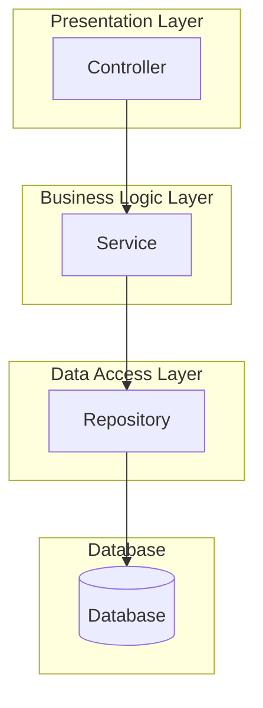
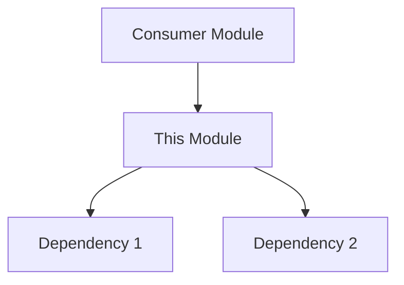

# Module XX: [Module Name]

**Module:** [Module Name]
**Version:** 1.0
**Status:** ⬜ Not Started
**Last Updated:** [DATE]
**Priority:** [HIGH/MEDIUM/LOW]
**Complexity:** [HIGH/MEDIUM/LOW]

---

## Source Code Reference

> **Purpose:** This section tracks which version of the source code was used to generate this module documentation.
> When code changes, compare against this reference to identify what needs updating.

| Field | Value |
|-------|-------|
| Repository | `[repository-url]` |
| Branch | `[branch-name]` |
| Commit Hash | `[full-commit-hash]` |
| Commit Date | `[YYYY-MM-DD HH:MM:SS]` |
| Commit Message | `[commit-message-summary]` |

**Source Code Location:**

```
[source-path]/src/main/kotlin/com/[project]/controller/[Controller].kt
[source-path]/src/main/kotlin/com/[project]/service/[Service].kt
```

**How to check for updates:**

```bash
# View commits since this reference
git log [commit-hash]..HEAD --oneline -- [relevant-paths]

# View detailed changes since reference
git diff [commit-hash]..HEAD -- [relevant-paths]
```

---

## 1. Module Overview

### 1.1 Purpose

[Brief description of what this module does and why it exists]

### 1.2 Scope

**In Scope:**

- [Feature 1]
- [Feature 2]

**Out of Scope:**

- [Feature that is NOT included]

### 1.3 Actors

| Actor | Description |
|-------|-------------|
| [Role] | [What this actor does with this feature] |

---

## 2. Submodules

| # | Submodule | File | Status | Priority |
|---|-----------|------|--------|----------|
| 01 | [Submodule Name] | [01_submodule/spec.md](./01_submodule/spec.md) | ⬜ Not Started | HIGH |
| 02 | [Submodule Name] | [02_submodule/spec.md](./02_submodule/spec.md) | ⬜ Not Started | MEDIUM |

---

## 3. Architecture Overview

### 3.1 Component Diagram



### 3.2 Key Files

| File | Type | Description |
|------|------|-------------|
| `[path]/Controller.kt` | Controller | REST API endpoints |
| `[path]/Service.kt` | Service | Business logic |
| `[path]/Repository.kt` | Repository | Database access |
| `[path]/Entity.kt` | Entity | Data model |

---

## 4. Key Business Rules

### BR-001: [Rule Name]

**Description:** [What the rule enforces]
**Condition:** [When this rule applies]
**Action:** [What happens when rule is triggered]

---

## 5. Integration Points

| System | Direction | Purpose |
|--------|-----------|---------|
| [System] | Inbound/Outbound | [Purpose] |

---

## 6. Related Documentation

### 6.1 Module Dependencies



### 6.2 Upstream Dependencies (Modules this module uses)

| Module | Purpose | Integration Point |
|--------|---------|-------------------|
| [Module XX: Name](../module_XX_name/INDEX.md) | [Why needed] | [How integrated] |

### 6.3 Downstream Consumers (Modules that depend on this module)

| Module | Purpose | Integration Point |
|--------|---------|-------------------|
| [Module XX: Name](../module_XX_name/INDEX.md) | [Why they need this] | [How they use it] |

### 6.4 Related Specs

- [Submodule 1](./01_submodule/spec.md) - [Brief description]
- [Submodule 2](./02_submodule/spec.md) - [Brief description]

---

## 7. Progress Tracking

| Submodule | Status | Completion % |
|-----------|--------|--------------|
| 01. [Name] | ⬜ Not Started | 0% |
| 02. [Name] | ⬜ Not Started | 0% |
| **Overall** | **⬜ Not Started** | **0%** |

---

## 8. Change Log

| Version | Date | Author | Changes |
|---------|------|--------|---------|
| 1.0 | [DATE] | [Author] | Initial module structure |
