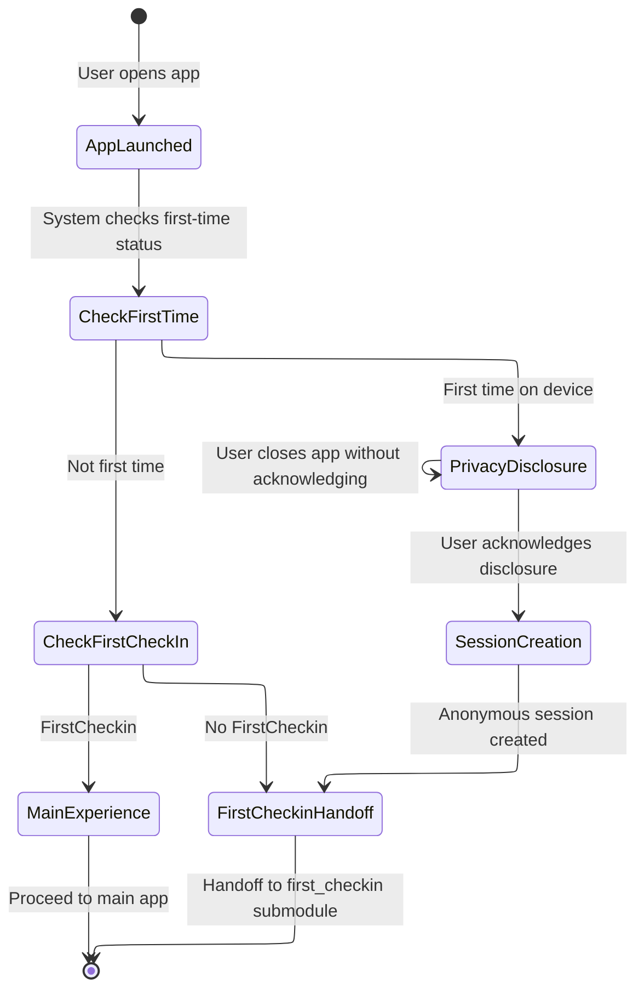
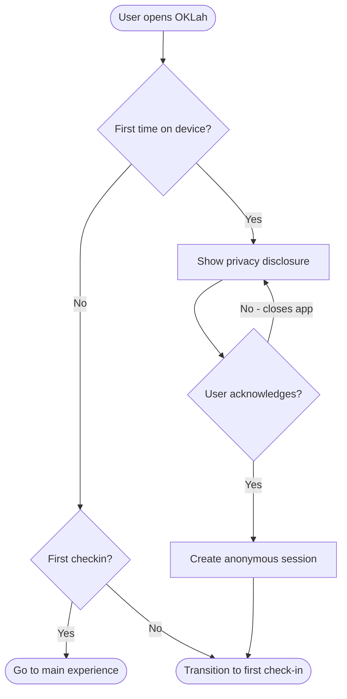

# Spec: Anonymous Onboarding

**Module:** Onboarding
**Submodule:** Anonymous Onboarding
**Version:** 1.0
**Status:** Draft
**Last Updated:** 2026-02-06
**Author:** BA (via Speckit)
**PRD Reference:** OKL-PRD-001 — Onboarding & First Check-in
**BRD Reference:** OKL-BRD-001

---

## 1. Overview

### 1.1 Purpose

This submodule specifies the behavior for a new user's first interaction with OKLah: launching the app for the first time, receiving a clear privacy disclosure, and having an anonymous session created — all without requiring any form of registration or identity.

### 1.2 Scope

**In Scope:**

- First-time app launch detection
- Privacy transparency disclosure (presented before any data is created)
- Anonymous session creation (after user acknowledges privacy disclosure)
- Transition to first check-in flow

**Out of Scope:**

- Account registration or identity verification (NG-01)
- Cross-device recovery (PRD-004)
- The check-in action itself (handled by `onboarding/first_checkin`)
- Long-term engagement mechanics
- Social sharing or community features

### 1.3 Actors

| Actor | Description |
|-------|-------------|
| New User | An individual opening OKLah for the first time on a device |

---

## 2. User Stories

### US-AO-001: Anonymous First-Time Access

**As a** new user,
**I want to** open OKLah and start using it immediately without creating an account,
**So that** I can engage without friction or identity risk.

**Acceptance Criteria:**

- [ ] Given the user opens OKLah for the first time, when the app launches, then the user is NOT asked to register, log in, or provide any personally identifiable information.
- [ ] Given the user opens OKLah for the first time, when the app launches, then an anonymous session is created after the user acknowledges the privacy disclosure.
- [ ] Given the user has already completed onboarding on this device, when they open the app again, then they are taken directly to the main experience (not onboarding).

**Priority:** HIGH

---

### US-AO-002: Privacy Transparency at First Use

**As a** new user,
**I want to** understand how OKLah handles my data before I start using it,
**So that** I can trust the app and make an informed decision to continue.

**Acceptance Criteria:**

- [ ] Given the user opens OKLah for the first time, when the app loads, then a privacy disclosure is presented before any user data is collected or session is created.
- [ ] Given the privacy disclosure is displayed, when the user reads it, then it clearly communicates: (a) no personal information is collected, (b) data stays on the device by default, (c) the app is anonymous by design.
- [ ] Given the privacy disclosure is displayed, when the user acknowledges it, then the app proceeds to create an anonymous session and transitions toward the first check-in.
- [ ] Given the privacy disclosure is displayed, when the user has NOT yet acknowledged it, then no session or user data is created.

**Priority:** HIGH

---

## 3. Business Rules

### BR-OKL-001: Anonymous by Default

**Description:** Users SHALL be able to use OKLah without providing personally identifiable information.
**Condition:** Always; applies to all users from first launch onward.
**Action:** The system creates an anonymous session with no PII collected.
**Error Message:** N/A (the system must not request PII; there is no failure path for this rule).

---

### BR-OKL-002: Privacy-First Data Minimization

**Description:** Only minimal data required for core functionality SHALL be collected and retained.
**Condition:** At every point where data is created or stored.
**Action:** The system collects only what is necessary for anonymous session identity and check-in functionality. No telemetry, analytics identifiers, or behavioral tracking beyond what the PRD explicitly defines.
**Error Message:** N/A (design constraint, not a user-facing rule).

---

### BR-OKL-007: Privacy Transparency at First Use

**Description:** Users SHALL be informed of privacy principles at first use.
**Condition:** First time the user opens OKLah on a device.
**Action:** A privacy disclosure is displayed and must be acknowledged before the session is created.
**Error Message:** N/A (the disclosure is mandatory and blocking; the user cannot proceed without acknowledgement).

---

## 4. Functional Behavior

### 4.1 First-Time Detection

The system must determine whether the current app launch is the user's first time on this device.

- If **first time** (no session exists): enter the onboarding flow (privacy disclosure → session creation → first check-in handoff).
- If **not first time, check-in complete** (session exists + completion flag set): skip onboarding entirely; proceed to the main experience.
- If **not first time, no check-in** (session exists + completion flag not set): skip onboarding; proceed directly to the first check-in flow.

First-time detection invariant: The user has completed onboarding if and only if both (1) a local completion flag is true AND (2) a valid anonymous session exists. If either condition is not met, the system treats the launch as first-time and enters the onboarding flow. This handles app data clearing, reinstallation, and auth session expiry.

### 4.2 Privacy Disclosure

The privacy disclosure is a mandatory, blocking step presented on first launch.

**Content requirements (must convey all of the following):**

1. OKLah does not collect personal information.
2. Data is stored locally on the device by default.
3. The experience is anonymous by design.

**Behavioral rules:**

- The disclosure MUST be presented before any anonymous session or user data is created.
- The user MUST explicitly acknowledge the disclosure (e.g., tap a "Got it" or "Continue" action).
- Passive dismissal (e.g., swiping away, pressing back) does NOT count as acknowledgement.
- If the user closes the app without acknowledging, the disclosure MUST be shown again on next launch.

### 4.3 Anonymous Session Creation

After the user acknowledges the privacy disclosure:

1. The system creates an anonymous session for the device.
2. No personally identifiable information is collected or stored.
3. Only the minimal data required for the app to function is persisted (per BR-OKL-002).

### 4.4 Transition to First Check-in

After session creation, the user is transitioned to the first check-in flow (specified in onboarding/first_checkin). The anonymous onboarding submodule's responsibility ends at the point of successful session creation and handoff. This submodule does NOT set a "completed" flag. The onboarding-complete flag is set by onboarding/first_checkin after the first check-in is successfully recorded. On subsequent launches, a user with a valid session but no completed check-in is routed directly to the first check-in screen — not back to the privacy disclosure.

---

## 5. State Transitions

**Cross-submodule note:** The `CheckFirstCheckIn` state reads a completion flag written by `onboarding/first_checkin` (see first_checkin spec 4.5). This routing gate is defined here for completeness as a full app-launch decision tree; the flag's semantics are owned by the `first_checkin` submodule.

---

## 6. Validation Rules

| Rule | Description |
|------|-------------|
| VR-AO-001 | Privacy disclosure acknowledgement is required before session creation. Passive dismissal is not valid acknowledgement. |
| VR-AO-002 | If the user has already completed onboarding on this device, the onboarding flow must not be shown again. |
| VR-AO-003 | No PII fields may exist in the session creation process. |

---

## 7. Error & Edge Cases

| # | Scenario | Expected Behavior |
|---|----------|-------------------|
| E-AO-001 | User force-closes app during privacy disclosure (before acknowledging). | On next launch, privacy disclosure is shown again from the beginning. No session is created. |
| E-AO-002 | User force-closes app after acknowledging disclosure but before session creation completes. | On next launch, system detects no valid session exists. The privacy disclosure is shown again from the beginning (acknowledgement is not persisted independently from session creation). The key invariant: the user must have a valid session before proceeding. |
| E-AO-003 | Device has no storage available for session creation. | The system should display a user-friendly error indicating the app cannot start. The user should not be left on a blank or broken screen. |
| E-AO-004 | User somehow triggers onboarding flow on a device that already has a session. | The system must detect the existing session in device and an anonymous session at server. Missing either will restart onboarding. |

---

## 8. Acceptance Criteria (Summary)

| # | Criterion | Traces To |
|---|-----------|-----------|
| AC-AO-01 | A new user can open OKLah and reach the first check-in flow without providing any personal information. | G-01, BR-OKL-001 |
| AC-AO-02 | Privacy principles are clearly communicated before any data is created. | G-02, BR-OKL-007 |
| AC-AO-03 | Privacy disclosure requires explicit acknowledgement; passive dismissal does not proceed. | BR-OKL-007 |
| AC-AO-04 | An anonymous session is created only after privacy acknowledgement. | BR-OKL-001, BR-OKL-002 |
| AC-AO-05 | Returning users with a valid session skip the privacy disclosure. Users with a session but no completed check-in are routed to the first check-in screen, not back to onboarding. | G-01 |
| AC-AO-06 | No PII is collected at any point during onboarding. | BR-OKL-001, BR-OKL-002 |

---

## 9. Analytics (Business-Level Intent)

| Event | Intent | Notes |
|-------|--------|-------|
| `onboarding_started` | Track how many installs reach the onboarding flow. | Fired when first-time detection identifies a new user. |
| `privacy_disclosure_shown` | Confirm disclosure is being presented. | Currently matches `onboarding_started` 1:1 because first-time detection always leads directly to the disclosure. Kept as separate events to allow future divergence (e.g., if a welcome screen is inserted before the disclosure). |
| `privacy_disclosure_acknowledged` | Track conversion from disclosure to acknowledgement. | Key funnel metric: drop-off here = trust barrier. |
| `anonymous_session_created` | Confirm session creation succeeded after acknowledgement. | Should match `privacy_disclosure_acknowledged` 1:1 in normal flow. |
| `onboarding_completed` | Track full onboarding completion (session created, ready for first check-in). | Measures end-to-end onboarding success. |

---

## 10. Workflow / Process Flow

---

## 11. Related Documentation

### 11.1 Upstream Dependencies

| Document | Purpose |
|----------|---------|
| OKL-BRD-001 | Authoritative business rules (BR-OKL-001, BR-OKL-002, BR-OKL-007) |
| OKL-PRD-001 | Product requirements for onboarding & first check-in |

### 11.2 Downstream Consumers

| Submodule | Purpose |
|-----------|---------|
| `onboarding/first_checkin` | Receives the user after anonymous session creation to complete first check-in |

---

## 12. Open Questions / TBD

| # | Question | Status | Decision |
|---|----------|--------|----------|
| — | None | — | All decisions resolved at PRD level |

---

## 13. Change Log

| Version | Date | Author | Changes |
|---------|------|--------|---------|
| 1.0 | 2026-02-06 | BA (via Speckit) | Initial draft generated from OKL-PRD-001 |
