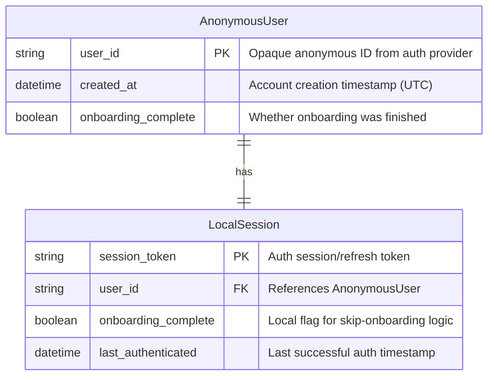
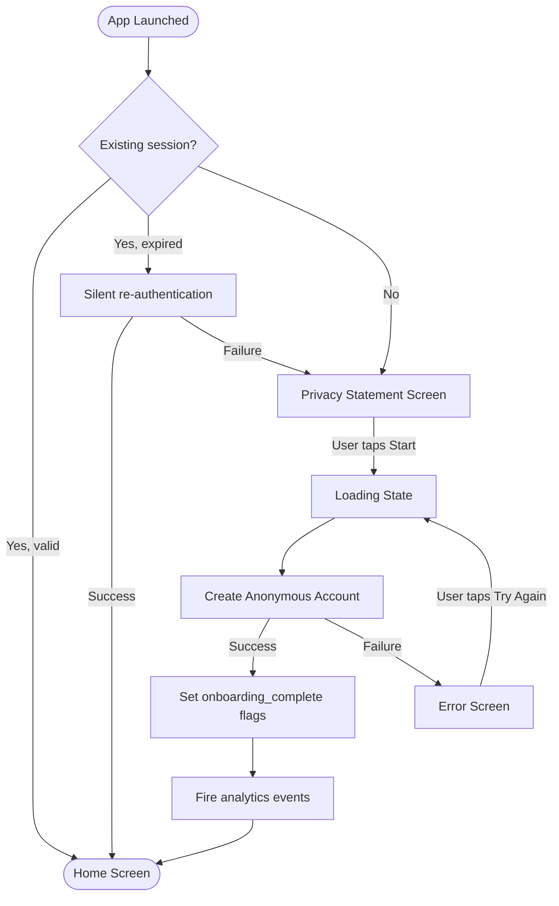
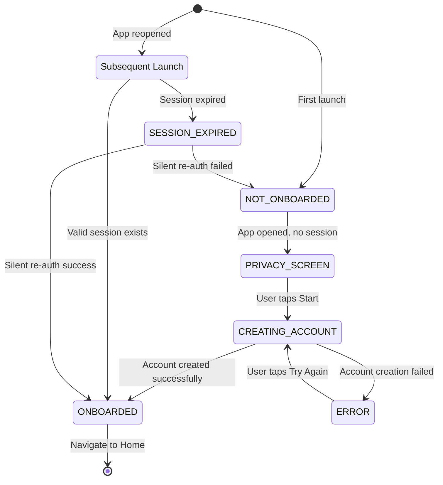

# Spec: Anonymous Onboarding

**Module:** Onboarding
**Submodule:** Anonymous Onboarding
**Version:** 1.0
**Status:** Draft
**Last Updated:** 2025-02-02
**Author:** BA (Claude)
**Derived From:** OKL-PRD-001 (FR-001), OKL-BRD-001 (C1), OKL-BRF-001 §6

---

## Source Code Reference

> **N/A — Pre-implementation specification.** This FSD is derived from OKL-PRD-001 and upstream business documents. Source code references will be added once implementation begins.

---

## 1. Overview

### 1.1 Purpose

This submodule defines the functional behavior of OKLah's anonymous onboarding flow — the experience from first app launch to the user arriving on the Home screen with a valid anonymous session. The goal is to get the user to "first value" (the Home screen with the check-in action available) in under 2 minutes with zero personal data required.

### 1.2 Scope

**In Scope:**

- First-launch detection
- Privacy statement screen
- Anonymous account creation (automatic)
- Session establishment and persistence
- Transition to Home screen
- Onboarding completion tracking

**Out of Scope:**

- Named/identified account creation (email, phone, social login)
- Account linking or upgrade flows
- Push notification permission prompts (handled separately)
- Settings or preferences configuration
- Any check-in functionality (see `first_checkin/spec.md`)

## Out of Scope (Explicit)

The following are intentionally excluded from PRD-001 and will be addressed in future PRDs:

- Accessibility-specific requirements
- Localization / i18n
- Tablet / landscape-specific layouts
- App update re-onboarding scenarios
- OS-level permission denial handling

### 1.3 Actors

| Actor | Description |
|-------|-------------|
| New User | A person who has just installed and launched OKLah for the first time |
| System | The OKLah app client and backend auth service |

---

## 2. User Stories

### US-ONB-001: View Privacy Statement on First Launch

**As a** new user
**I want to** see a clear, concise privacy statement when I first open the app
**So that** I understand OKLah respects my privacy before I commit to using it

**Acceptance Criteria:**

- [ ] Given the app is launched for the first time, when the app opens, then a privacy statement screen is displayed
- [ ] Given the privacy statement screen is displayed, when the user reads it, then the statement is concise (no legal wall — aim for ≤ 3 short bullet points or sentences)
- [ ] Given the privacy statement screen is displayed, then there is exactly one primary CTA button labeled "Start"
- [ ] Given the privacy statement screen is displayed, then no personal data input fields are present

**Priority:** HIGH
**Story Points:** 3

---

### US-ONB-002: Create Anonymous Account Automatically

**As a** new user
**I want to** have an account created automatically without providing personal information
**So that** I can start using the app immediately with no friction

**Acceptance Criteria:**

- [ ] Given the user taps "Start" on the privacy screen, when the system processes the action, then an anonymous account is created automatically
- [ ] Given the anonymous account creation succeeds, when it completes, then the user is navigated to the Home screen
- [ ] Given the anonymous account is created, then no name, email, phone, or other identity field was required
- [ ] Given the user is navigated to the Home screen, a random motivational message will be displayed
- [ ] Given a network error during account creation, when the creation fails, then the user sees a retry-able error message

**Priority:** HIGH
**Story Points:** 5

---

### US-ONB-003: Persist Session Across Restarts

**As a** returning user
**I want to** remain signed in when I reopen the app
**So that** I don't have to go through onboarding again

**Acceptance Criteria:**

- [ ] Given the user has completed onboarding, when the app is closed and reopened, then the user lands on the Home screen (not the onboarding screen)
- [ ] Given the user has a valid persisted session, when the app launches, then no onboarding screens are shown
- [ ] Given the session token has expired or been invalidated, when the app launches, then a silent re-authentication is attempted up to three times before falling back to onboarding

**Priority:** HIGH
**Story Points:** 3

---

## 3. Business Rules

### BR-ONB-001: No Personal Data Required

**Description:** The onboarding flow must complete without collecting any personal identity data.
**Condition:** Always, during onboarding.
**Action:** The system creates an anonymous account using only a system-generated identifier. No form fields for name, email, phone, or address are presented.
**Error Message:** N/A (no user input to validate).

---

### BR-ONB-002: Single Onboarding Per Device Install

**Description:** A user sees the onboarding flow only once per installation.
**Condition:** The app detects no existing session or onboarding-complete flag on launch.
**Action:** If onboarding has been completed (flag persisted locally), skip directly to Home screen on subsequent launches. If the flag is missing but a valid anonymous session exists, skip onboarding and navigate to Home screen.
**Error Message:** N/A.

---

### BR-ONB-003: Privacy Statement Must Be Displayed Before Account Creation

**Description:** The user must see the privacy statement before any account is created.
**Condition:** First launch, before "Start" is tapped.
**Action:** No network calls for account creation occur until the user taps "Start." The privacy screen is a gate. The system must ensure the privacy screen can only be dismissed by user tapping "Start".
**Error Message:** N/A.

---

### BR-ONB-004: Anonymous Identity is System-Generated

**Description:** The anonymous user identifier is generated by the authentication service, not derived from any device identifier that could be used for cross-app tracking.
**Condition:** Account creation.
**Action:** The system requests an anonymous credential from the auth provider. The auth provider must generate three unique, finctional identifiers. These identifiers must be randomly selected from a library of terms associated with happiness and motivation. The user must select one of these three options to finalize their anonymous profile. The resulting `user_id` is an opaque, non-reversible identifier.
**Error Message:** N/A.

---

## 4. Data Model

### 4.1 Entity Diagram



### 4.2 Field Specifications

#### AnonymousUser (Backend)

| Field | Type | Required | Default | Description |
|-------|------|----------|---------|-------------|
| user_id | string | Yes | Auto-generated | Opaque anonymous identifier from auth provider |
| created_at | datetime | Yes | Server timestamp | UTC timestamp of account creation |
| onboarding_complete | boolean | Yes | false | Set to true when user reaches Home screen |

#### LocalSession (Device)

| Field | Type | Required | Default | Description |
|-------|------|----------|---------|-------------|
| session_token | string | Yes | From auth provider | Auth token for API calls |
| user_id | string | Yes | From auth provider | Anonymous user ID |
| onboarding_complete | boolean | Yes | false | Local flag to skip onboarding on relaunch |
| last_authenticated | datetime | Yes | Auth timestamp | Last successful authentication time |

---

## 5. API Specifications

> **Note:** This section describes logical API operations. Actual endpoints/SDKs will depend on the chosen auth provider (e.g., Firebase Anonymous Auth SDK calls). The FSD does not prescribe infrastructure.

### 5.1 Create Anonymous Account

**Operation:** Create anonymous credential
**Authorization:** None (unauthenticated call)
**Description:** Creates a new anonymous user account and returns a session token + user ID.

**Request:** (SDK call — no explicit HTTP body)

```
signInAnonymously()
```

**Response (Success):**

```json
{
  "user_id": "abc123-anon-uuid",
  "session_token": "eyJ...",
  "created_at": "2025-02-02T10:00:00Z"
}
```

**Response (Error):**

```json
{
  "error_code": "AUTH_UNAVAILABLE",
  "message": "Unable to create account. Please check your connection and try again."
}
```

**Validation Rules:**

- No input validation required (no user input).
- Network connectivity is the only precondition.

---

## 6. UI/UX Specifications

### 6.1 Screen: Privacy Statement (Onboarding)

**Purpose:** Communicate OKLah's privacy-first philosophy and gate account creation behind user consent.
**Entry Point:** First app launch (no existing session detected).
**Exit Points:** Home screen (after tapping "Start" and successful account creation).

**Layout:**

```
+------------------------------------------+
|                                          |
|             [App Logo / Icon]            |
|                                          |
|           "Welcome to OKLah"             |
|                                          |
|  • Your privacy comes first              |
|  • No name, email, or phone needed       |
|  • Your data stays on your device        |
|                                          |
|                                          |
|          +--------------------+          |
|          |      Start         |          |
|          +--------------------+          |
|                                          |
+------------------------------------------+
```

**Fields:** None (no input fields).

**Actions:**

| Action | Trigger | Behavior |
|--------|---------|----------|
| Start | Tap "Start" button | Show loading indicator → create anonymous account → on success navigate to Home → on failure show error with retry |

**Design Constraints:**

- The "Start" button is the single dominant CTA.
- No secondary actions, links to terms, or skip buttons on this screen.
- Privacy bullets should be scannable in < 5 seconds.

---

### 6.2 Screen: Loading / Account Creation

**Purpose:** Provide feedback while the anonymous account is being created.
**Entry Point:** User tapped "Start."
**Exit Points:** Home screen (success) or error state (failure).

**Layout:**

```
+------------------------------------------+
|                                          |
|          [Spinner / Animation]           |
|                                          |
|         "Setting things up..."           |
|                                          |
+------------------------------------------+
```

**Notes:** This may be a brief overlay or inline loading state on the privacy screen rather than a separate screen. The key requirement is visible feedback that something is happening.

---

### 6.3 Screen: Error State

**Purpose:** Inform the user that account creation failed and offer a retry.
**Entry Point:** Account creation failure.
**Exit Points:** Retry → loading state, or app remains on error.

**Layout:**

```
+------------------------------------------+
|                                          |
|          [Error Icon]                    |
|                                          |
|  "Something went wrong.                 |
|   Please check your connection           |
|   and try again."                        |
|                                          |
|          +--------------------+          |
|          |     Try Again      |          |
|          +--------------------+          |
|                                          |
+------------------------------------------+
```

---

## 7. Workflow / Process Flow



### 7.1 Process Steps

| Step | Actor | Action | System Response |
|------|-------|--------|-----------------|
| 1 | System | Detect app launch | Check for existing local session |
| 2 | System | No session found | Display Privacy Statement screen |
| 3 | User | Tap "Start" | Show loading indicator |
| 4 | System | Call anonymous auth | Create anonymous account |
| 5 | System | Account created | Persist session locally, set onboarding_complete = true |
| 6 | System | Fire `onboarding_start` and `onboarding_complete` events | Analytics recorded |
| 7 | System | Navigate to Home | Home screen displayed with check-in action available |

---

## 8. State Transitions



**State Definitions:**

| State | Description |
|-------|-------------|
| NOT_ONBOARDED | No anonymous account exists on this device |
| PRIVACY_SCREEN | User is viewing the privacy statement |
| CREATING_ACCOUNT | Anonymous account creation is in progress |
| ERROR | Account creation failed; retry available |
| ONBOARDED | Anonymous account exists and session is valid |
| SESSION_EXPIRED | Session token is no longer valid |

---

## 9. Validation Rules

| Rule ID | Field/Action | Rule | Error Behavior |
|---------|-------------|------|----------------|
| VR-ONB-001 | Start button | Disabled while account creation is in progress (prevent double-tap) | Button shows loading state |
| VR-ONB-002 | Network | Network connectivity required for account creation | Show error screen with retry |
| VR-ONB-003 | Session check | On launch, validate session token is not expired | If expired, attempt silent re-auth |

---

## 10. Error Handling

| Error Code | Condition | User-Facing Message | Resolution |
|------------|-----------|---------------------|------------|
| ERR-ONB-001 | Network unavailable during account creation | "Something went wrong. Please check your connection and try again." | Show retry button |
| ERR-ONB-002 | Auth service unavailable / server error | "Something went wrong. Please check your connection and try again." | Show retry button (same UX — user doesn't need to distinguish) |
| ERR-ONB-003 | Silent re-auth failed on relaunch | N/A (no message — silently fall back to onboarding) | Show privacy screen, create new anonymous account |

---

## 11. Edge Cases

| # | Scenario | Expected Behavior |
|---|----------|-------------------|
| 1 | User kills app during account creation | On next launch, no session exists → show onboarding again |
| 2 | User uninstalls and reinstalls | New anonymous account created (previous data lost) |
| 3 | User has no internet on first launch | Privacy screen displays (no network needed). On "Start" tap, show error with retry |
| 4 | Device clock significantly wrong | Rely on server-generated timestamps for `created_at`; local display uses device time |
| 5 | Multiple rapid taps on "Start" | Button disabled after first tap; only one account creation request fires |
| 6 | Auth provider returns rate-limit error | Treat as ERR-ONB-002; show retry screen |
| 7 | App backgrounded during account creation | On return to foreground, check if creation completed; if not, the system SHALL retry silently once; if the retry fails, the error screen SHALL be shown |

---

## 12. Security & Permissions

### 12.1 Required Permissions

| Permission | Description |
|------------|-------------|
| Internet | Required for anonymous account creation |

No other device permissions are requested during onboarding.

### 12.2 Data Access Rules

- No personal data is collected or stored during onboarding.
- The anonymous `user_id` is not derived from device identifiers (IDFA, Android Advertising ID, etc.).
- Session tokens are stored in secure device storage (Keychain / Keystore equivalent).
- No data is shared with third parties during onboarding.

---

## 13. Analytics Events (Business-Level)

| Event Name | Trigger | Properties | Purpose |
|------------|---------|------------|---------|
| `onboarding_start` | Privacy screen is displayed | `user_id` (anon), `timestamp`, `app_version` | Measure funnel entry; detect install-to-open drop-off |
| `onboarding_complete` | User successfully arrives on Home screen after account creation | `user_id` (anon), `timestamp`, `app_version`, `duration_ms` | Measure onboarding completion rate and time-to-complete |
| `onboarding_error` | Account creation fails | `user_id` (placeholder), `timestamp`, `app_version`, `error_code` | Monitor failure rates; detect auth service issues |
| `onboarding_retry` | User taps "Try Again" after error | `user_id` (placeholder), `timestamp`, `app_version`, `attempt_number` | Measure retry engagement and recovery rate |

**Notes:**

- `onboarding_start` fires before a `user_id` is assigned by the auth provider. Use a device-local placeholder or fire this event retroactively after account creation with the assigned ID.
- `duration_ms` on `onboarding_complete` captures the total time from privacy screen display to Home screen arrival.

---

## 14. Non-Functional Requirements

| Requirement | Target | Measurement |
|-------------|--------|-------------|
| Onboarding completion time | < 2 minutes end-to-end | `duration_ms` on `onboarding_complete` event |
| Account creation latency | < 3 seconds on typical mobile network | Time from "Start" tap to account creation callback |
| Session persistence | Survives app restart and device restart | Manual + automated testing |
| Privacy screen render | < 1 second from app launch | Time to first meaningful paint |

---

## 15. Open Questions / TBD

| # | Question | Status | Decision |
|---|----------|--------|----------|
| 1 | Should the privacy screen include a link to a full privacy policy (web page)? | Open | Assumed: No for MVP — keep minimal. Revisit if legal review requires it. |
| 2 | Should `onboarding_start` fire before or after account creation (given no user_id exists yet)? | Open | Assumed: Fire with device-local placeholder, backfill user_id after creation. |
| 3 | What happens if the auth provider changes its anonymous auth mechanism? | Open | Assumed: Abstract behind an auth service interface so provider can be swapped. |
| 4 | Should we track the number of retry attempts before success? | Open | Assumed: Yes, via `attempt_number` on `onboarding_retry`. |

---

## 16. Related Documentation

### 16.1 Related Modules

| Module | Relationship | Description |
|--------|--------------|-------------|
| [Onboarding: First Check-in](../first_checkin/spec.md) | Next step | User proceeds to first check-in after onboarding completes |

### 16.2 Upstream Dependencies

| Module | Purpose | Integration Point |
|--------|---------|-------------------|
| Auth Provider (e.g., Firebase Anonymous Auth) | Anonymous account creation | SDK call for `signInAnonymously()` |

### 16.3 Downstream Consumers

| Module | Purpose | Integration Point |
|--------|---------|-------------------|
| First Check-in | Requires valid anonymous session | `user_id` and `session_token` from onboarding |
| Home Screen | Displays check-in UI | Only accessible after `onboarding_complete = true` |

---

## 17. Traceability Matrix

| PRD Requirement | FSD Coverage |
|-----------------|-------------|
| FR-001: Anonymous account creation on first launch | US-ONB-002, BR-ONB-001, BR-ONB-004, §5.1 |
| AC-001: First check-in in < 2 minutes | §14 NFR (onboarding < 2 min target) |
| AC-002: No personal identity field required | BR-ONB-001, §6.1 (no input fields) |
| PRD §4: Concise privacy statement | US-ONB-001, §6.1 |
| PRD §4: One primary CTA "Start" | US-ONB-001, §6.1 |

---

## 18. Assumptions

| # | Assumption | Rationale |
|---|-----------|-----------|
| 1 | Firebase Anonymous Auth (or equivalent) is the auth mechanism | Per BRF-001 §11 dependency list |
| 2 | No legal/compliance review is required for MVP privacy statement copy | PRD says "concise privacy statement" — not a legal document |
| 3 | Uninstall + reinstall creates a brand new anonymous account (no recovery) | Privacy-first: no device fingerprinting to link old accounts |
| 4 | The loading state during account creation is brief enough to not need a cancel action | Typical anonymous auth < 3 seconds |
| 5 | Session expiry and re-auth are handled silently without user-facing flows | Only falls back to onboarding if silent re-auth fails |

---

## 19. Change Log

| Version | Date | Author | Changes |
|---------|------|--------|---------|
| 1.0 | 2025-02-02 | BA (Claude) | Initial draft derived from OKL-PRD-001 |
