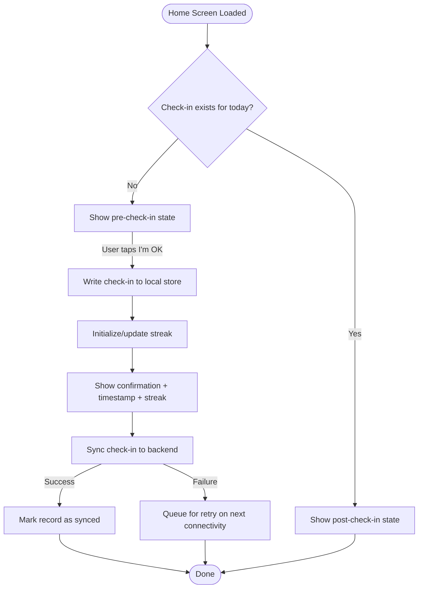
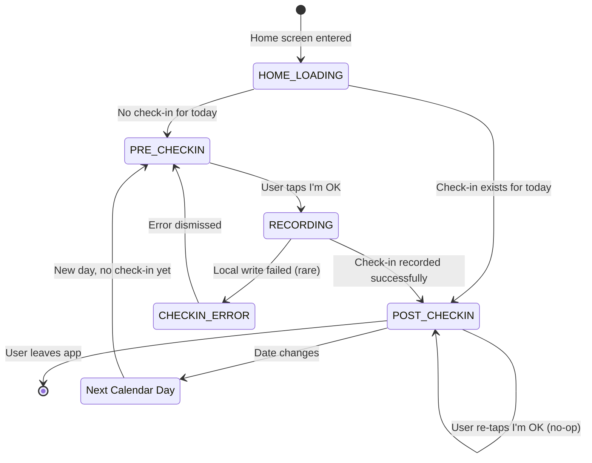

# Spec: First Check-in

**Module:** Onboarding
**Submodule:** First Check-in
**Version:** 1.0
**Status:** Draft
**Last Updated:** 2025-02-02
**Author:** BA (Claude)
**Derived From:** OKL-PRD-001 (FR-002, FR-003, FR-004, FR-005), OKL-BRD-001 (C2, C3), OKL-BRF-001 §6

---

## Source Code Reference

> **N/A — Pre-implementation specification.** This FSD is derived from OKL-PRD-001 and upstream business documents. Source code references will be added once implementation begins.

---

## 1. Overview

### 1.1 Purpose

This submodule defines the functional behavior of the user's first check-in — the moment on the Home screen where a newly onboarded user taps "I'm OK," the system records the event, displays confirmation, and initializes the streak to Day 1. This is the "first value" moment of OKLah.

### 1.2 Scope

**In Scope:**

- Home screen layout with "I'm OK" check-in action
- Check-in event recording (local + backend)
- Confirmation UI (timestamp display)
- Streak initialization (Day 1)
- Last check-in timestamp display on Home screen
- Data persistence across app restarts

**Out of Scope:**

- Subsequent check-ins beyond Day 1 (same mechanics, but streak increment logic for Day 2+ is a separate spec)
- Missed check-in detection and nudges
- Achievements beyond streak start
- Settings or threshold configuration
- Emergency contacts or escalation

### 1.3 Actors

| Actor | Description |
|-------|-------------|
| Onboarded User | A user who has completed anonymous onboarding and has a valid session |
| System | The OKLah app client and backend data store |

---

## 2. User Stories

### US-CHK-001: Perform First Check-in

**As an** onboarded user
**I want to** tap a single "I'm OK" button on the Home screen
**So that** I record that I am okay today

**Acceptance Criteria:**

- [ ] Given the user is on the Home screen after onboarding, when the screen loads, then a single dominant "I'm OK" button is displayed
- [ ] Given the user taps "I'm OK," when the tap is registered, then a check-in event is recorded
- [ ] Given the check-in is recorded, when the recording completes, then a confirmation is displayed showing the check-in timestamp
- [ ] Given the check-in is recorded, then the data is persisted both locally and to the backend store

**Priority:** HIGH
**Story Points:** 5

---

### US-CHK-002: View Last Check-in Time

**As a** user who has checked in
**I want to** see my last check-in time on the Home screen
**So that** I know when I last confirmed I'm okay

**Acceptance Criteria:**

- [ ] Given the user has completed a check-in, when the Home screen is displayed, then the last check-in timestamp is visible
- [ ] Given the user has just completed a check-in, when the confirmation is shown, then the timestamp updates immediately (no page refresh needed)
- [ ] Given the user reopens the app after a check-in, when the Home screen loads, then the last check-in timestamp is displayed from persisted data
- [ ] Given the timestamp is displayed, then it is shown in a human-friendly relative or absolute format localized to the user's device locale and timezone

**Priority:** HIGH
**Story Points:** 3

---

### US-CHK-003: Initialize Streak on First Check-in

**As a** first-time user
**I want to** see my streak start at Day 1 after my first check-in
**So that** I feel a sense of progress and motivation to continue

**Acceptance Criteria:**

- [ ] Given the user has no prior check-in history, when the first check-in is recorded, then the streak counter is initialized to 1
- [ ] Given the streak is initialized, when the Home screen updates, then "Day 1" (or equivalent) is displayed
- [ ] Given the streak value is 1, when the app is restarted, then the streak value persists and is still displayed as 1

**Priority:** HIGH
**Story Points:** 3

---

### US-CHK-004: Check-in Persists Across App Restarts

**As a** user
**I want to** see my check-in data preserved when I close and reopen the app
**So that** I trust the app is reliably tracking my status

**Acceptance Criteria:**

- [ ] Given a check-in has been recorded, when the app is force-closed and reopened, then the last check-in timestamp is still displayed
- [ ] Given a check-in has been recorded, when the app is force-closed and reopened, then the streak value is still displayed
- [ ] Given a check-in was recorded while offline, when the device regains connectivity, then the check-in syncs to the backend

**Priority:** HIGH
**Story Points:** 3

---

## 3. Business Rules

### BR-CHK-001: One Check-in Per Calendar Day

**Description:** A user can perform at most one meaningful check-in per calendar day (based on the user's local device timezone).
**Condition:** User taps "I'm OK" when a check-in for today already exists.
**Action:** The system acknowledges the tap gracefully but does not create a duplicate check-in record. The existing timestamp is retained. The UI may show an affirmation (e.g., "You're already checked in today") or simply display the existing confirmation.
**Error Message:** None — this is not an error state. Handled gracefully in the UI.

---

### BR-CHK-002: Streak Initializes to 1 on First Check-in

**Description:** The first successful check-in sets the streak counter to 1.
**Condition:** User has zero prior check-ins.
**Action:** Set `current_streak = 1`, set `streak_start_date` to today, set `last_checkin_date` to today.
**Error Message:** N/A.

---

### BR-CHK-003: Check-in Requires Valid Anonymous Session

**Description:** A check-in can only be recorded if the user has a valid authenticated session.
**Condition:** User taps "I'm OK" without a valid session.
**Action:** This should not occur in normal flow (session is established during onboarding). If it does, the system attempts silent re-authentication. If re-auth fails, redirect to onboarding.
**Error Message:** N/A (handled transparently).

---

### BR-CHK-004: Local-First Persistence

**Description:** Check-in data is always written to local device storage first, then synced to backend.
**Condition:** Every check-in.
**Action:** Write to local store immediately upon tap. Queue backend sync. If backend sync fails, the check-in is still considered valid locally and will retry sync later.
**Error Message:** N/A (backend sync failure is invisible to the user).

---

### BR-CHK-005: Calendar Day Boundary

**Description:** "Today" is determined by the user's local device timezone.
**Condition:** Determining whether a check-in already exists for today, and for streak calculation.
**Action:** Compare `last_checkin_date` against the current date in the device's local timezone. A new calendar day starts at 00:00 local time.
**Error Message:** N/A.

---

## 4. Data Model

### 4.1 Entity Diagram

```mermaid
erDiagram
    AnonymousUser ||--o{ CheckIn : "records"
    AnonymousUser ||--|| StreakData : "has"
    AnonymousUser {
        string user_id PK
    }
    CheckIn {
        string checkin_id PK "Unique check-in identifier"
        string user_id FK "References AnonymousUser"
        datetime checked_in_at "UTC timestamp of check-in"
        date local_date "Calendar date in user local timezone"
        boolean synced "Whether synced to backend"
    }
    StreakData {
        string user_id PK_FK "References AnonymousUser"
        int current_streak "Current consecutive day count"
        date streak_start_date "Date the current streak began"
        date last_checkin_date "Most recent check-in date (local)"
    }
```

### 4.2 Field Specifications

#### CheckIn

| Field | Type | Required | Default | Description |
|-------|------|----------|---------|-------------|
| checkin_id | string | Yes | Auto-generated (UUID) | Unique identifier for this check-in event |
| user_id | string | Yes | From session | Anonymous user ID |
| checked_in_at | datetime | Yes | Current UTC timestamp | Precise moment of check-in (UTC) |
| local_date | date | Yes | Current device date | Calendar date in user's local timezone (for dedup and streak logic) |
| synced | boolean | Yes | false | Whether this record has been synced to backend |

#### StreakData

| Field | Type | Required | Default | Description |
|-------|------|----------|---------|-------------|
| user_id | string | Yes | From session | Anonymous user ID |
| current_streak | integer | Yes | 0 | Number of consecutive days checked in |
| streak_start_date | date | No | null | The date the current streak began |
| last_checkin_date | date | No | null | The most recent check-in calendar date (local timezone) |

---

## 5. API Specifications

> **Note:** This section describes logical operations. The actual transport (Firestore SDK, REST API, etc.) depends on architecture decisions outside this FSD.

### 5.1 Record Check-in

**Operation:** Create check-in record
**Authorization:** Valid anonymous session required
**Description:** Persists a check-in event to the backend store.

**Request:**

```json
{
  "user_id": "abc123-anon-uuid",
  "checked_in_at": "2025-02-02T10:30:00Z",
  "local_date": "2025-02-02"
}
```

**Response (Success):**

```json
{
  "success": true,
  "checkin_id": "chk-uuid-001",
  "checked_in_at": "2025-02-02T10:30:00Z"
}
```

**Response (Error — Duplicate):**

```json
{
  "success": false,
  "error_code": "CHECKIN_ALREADY_EXISTS",
  "message": "Check-in already recorded for this date."
}
```

**Response (Error — Auth):**

```json
{
  "success": false,
  "error_code": "UNAUTHORIZED",
  "message": "Invalid or expired session."
}
```

**Validation Rules:**

- `user_id` must match the authenticated session.
- `checked_in_at` must be a valid UTC datetime.
- `local_date` must be a valid date (YYYY-MM-DD).
- Only one check-in per `user_id` + `local_date` combination.

---

### 5.2 Get Latest Check-in

**Operation:** Retrieve most recent check-in for user
**Authorization:** Valid anonymous session required
**Description:** Returns the user's most recent check-in record (used on Home screen load if local data is unavailable).

**Request:**

```
getLatestCheckIn(user_id)
```

**Response (Success):**

```json
{
  "success": true,
  "data": {
    "checkin_id": "chk-uuid-001",
    "checked_in_at": "2025-02-02T10:30:00Z",
    "local_date": "2025-02-02"
  }
}
```

**Response (No Check-in Found):**

```json
{
  "success": true,
  "data": null
}
```

---

## 6. UI/UX Specifications

### 6.1 Screen: Home — Pre-Check-in State

**Purpose:** Present the primary "I'm OK" action to the user.
**Entry Point:** Onboarding completion (first time) or app launch (subsequent).
**Exit Points:** Post-check-in confirmation state (same screen, updated).

**Layout:**

```
+------------------------------------------+
|                                          |
|            OKLah                         |
|                                          |
|                                          |
|                                          |
|         +------------------+             |
|         |                  |             |
|         |     I'm OK       |             |
|         |                  |             |
|         +------------------+             |
|                                          |
|                                          |
|                                          |
|                                          |
+------------------------------------------+
```

**Key Elements:**

- The "I'm OK" button is the single dominant action on the screen.
- No competing CTAs, navigation menus, or distracting elements in the initial state.
- The button should be large, centrally placed, and easily tappable (minimum 48dp touch target).

---

### 6.2 Screen: Home — Post-Check-in State (Confirmation)

**Purpose:** Confirm the check-in was recorded and show status.
**Entry Point:** User taps "I'm OK."
**Exit Points:** User closes app, or next day the screen resets to pre-check-in state.

**Layout:**

```
+------------------------------------------+
|                                          |
|            OKLah                         |
|                                          |
|        ✓ You're checked in               |
|                                          |
|        Last check-in:                    |
|        Today at 10:30 AM                 |
|                                          |
|        🔥 Day 1                           |
|                                          |
|         +------------------+             |
|         |     I'm OK       |             |
|         |   (checked in)   |             |
|         +------------------+             |
|                                          |
+------------------------------------------+
```

**Key Elements:**

- Confirmation message: "You're checked in" (or equivalent affirmation).
- Last check-in timestamp displayed in human-friendly format.
- Streak counter: "Day 1" for first check-in.
- The "I'm OK" button remains visible but enters a "completed" visual state (e.g., muted color, checkmark icon). It remains tappable but re-tapping produces a gentle acknowledgement (see BR-CHK-001).

---

### 6.3 Screen: Home — Returning User (Already Checked In Today)

**Purpose:** Show returning users their current status.
**Entry Point:** App launch when a check-in exists for today.
**Exit Points:** User closes app.

**Layout:** Same as §6.2 (post-check-in state). The screen loads directly into confirmation state with persisted data.

---

### 6.4 Screen: Home — Returning User (New Day, No Check-in Yet)

**Purpose:** Prompt the user to check in for the new day.
**Entry Point:** App launch on a new calendar day.
**Exit Points:** Post-check-in state after tapping "I'm OK."

**Layout:**

```
+------------------------------------------+
|                                          |
|            OKLah                         |
|                                          |
|        Last check-in:                    |
|        Yesterday at 10:30 AM            |
|                                          |
|        🔥 Day 1 streak                    |
|                                          |
|         +------------------+             |
|         |                  |             |
|         |     I'm OK       |             |
|         |                  |             |
|         +------------------+             |
|                                          |
+------------------------------------------+
```

**Notes:** The streak display shows the current (not incremented) value. It only increments after the new check-in is recorded.

---

**Actions Summary:**

| Action | Trigger | Behavior |
|--------|---------|----------|
| Check in | Tap "I'm OK" (pre-check-in state) | Record check-in → update timestamp → initialize/update streak → show confirmation |
| Re-tap after check-in | Tap "I'm OK" (post-check-in state) | Show gentle acknowledgement; no duplicate record created |

---

## 7. Workflow / Process Flow



### 7.1 Process Steps

| Step | Actor | Action | System Response |
|------|-------|--------|-----------------|
| 1 | System | Load Home screen | Check local store for today's check-in |
| 2 | System | No check-in found | Display "I'm OK" button in active state |
| 3 | User | Tap "I'm OK" | Disable button (prevent double-tap) |
| 4 | System | Write check-in to local store | Record `checked_in_at` (UTC) and `local_date` |
| 5 | System | Update streak data | Set `current_streak = 1`, `last_checkin_date = today` |
| 6 | System | Update UI | Show confirmation, timestamp, streak counter |
| 7 | System | Sync to backend (async) | Send check-in record; mark synced on success |
| 8 | System | Fire `checkin_completed` event | Analytics recorded |

---

## 8. State Transitions



**State Definitions:**

| State | Description |
|-------|-------------|
| HOME_LOADING | Home screen is loading, checking local check-in data |
| PRE_CHECKIN | No check-in recorded for today; "I'm OK" button is active |
| RECORDING | Check-in is being written to local store |
| POST_CHECKIN | Check-in recorded; confirmation displayed |
| CHECKIN_ERROR | Local write failed (extremely rare — device storage issue) |

---

## 9. Validation Rules

| Rule ID | Field/Action | Rule | Error Behavior |
|---------|-------------|------|----------------|
| VR-CHK-001 | I'm OK button | Disabled during recording to prevent double-tap | Button shows brief loading/disabled state |
| VR-CHK-002 | Duplicate check-in | Only one check-in per `user_id` + `local_date` | Graceful no-op with affirmation message |
| VR-CHK-003 | Session validity | Must have valid anonymous session to record | Silent re-auth; if fails, redirect to onboarding |
| VR-CHK-004 | Timestamp | `checked_in_at` generated at moment of tap, not at sync time | Ensures accurate recording even if sync is delayed |
| VR-CHK-005 | Local date | Derived from device timezone at moment of tap | Used for dedup and streak calculation |

---

## 10. Error Handling

| Error Code | Condition | User-Facing Message | Resolution |
|------------|-----------|---------------------|------------|
| ERR-CHK-001 | Local storage write failure | "Unable to record your check-in. Please try again." | Show retry; this is extremely rare |
| ERR-CHK-002 | Backend sync failure | None (invisible to user) | Queue for automatic retry; check-in is valid locally |
| ERR-CHK-003 | Session expired during check-in | None (handled transparently) | Silent re-auth, then retry sync |
| ERR-CHK-004 | Backend returns CHECKIN_ALREADY_EXISTS | None (invisible to user) | Local record takes precedence; no user action needed |

---

## 11. Edge Cases

| # | Scenario | Expected Behavior |
|---|----------|-------------------|
| 1 | User taps "I'm OK" with no network | Check-in recorded locally and confirmed in UI. Backend sync queued for when connectivity returns. |
| 2 | User taps "I'm OK" twice rapidly | First tap is recorded; second tap is ignored (button disabled during recording). |
| 3 | User checks in at 11:59 PM, reopens app at 12:01 AM | The 11:59 PM check-in is recorded for the previous date. At 12:01 AM, the Home screen shows pre-check-in state for the new day. |
| 4 | User changes device timezone after checking in | The check-in record retains the `local_date` from the original timezone. The new day boundary uses the new timezone. This may cause minor streak ambiguity — accepted trade-off for MVP. |
| 5 | User force-closes app immediately after tapping "I'm OK" | If local write completed, check-in is preserved. If local write did not complete, check-in is lost and user sees pre-check-in state on next launch. |
| 6 | Backend already has a check-in for today (e.g., from another device — unlikely with anonymous accounts) | Backend returns CHECKIN_ALREADY_EXISTS; local record is retained; no user-facing error. |
| 7 | App is open across midnight (date boundary) | The screen does not auto-refresh. User will see updated state on next app open or foregrounding. Assumption: no real-time date-change listener needed for MVP. |
| 8 | First check-in fails locally, user retries and succeeds | Streak initializes to 1 on the successful attempt. No partial state. |

---

## 12. Security & Permissions

### 12.1 Required Permissions

| Permission | Description |
|------------|-------------|
| Internet | Required for backend sync (check-in works offline via local-first) |

No additional device permissions required for check-in.

### 12.2 Data Access Rules

- Check-in data is scoped to the anonymous `user_id`. No cross-user data access.
- Backend enforces that `user_id` in the request matches the authenticated session.
- Check-in records contain no personal data — only an opaque ID and timestamps.
- Local storage is accessible only to the OKLah app (sandboxed).

---

## 13. Analytics Events (Business-Level)

| Event Name | Trigger | Properties | Purpose |
|------------|---------|------------|---------|
| `checkin_completed` | Check-in successfully recorded (locally) | `user_id` (anon), `timestamp`, `app_version`, `streak_count`, `is_first_checkin` (boolean) | Core engagement metric; measure activation and daily habit |
| `checkin_duplicate_tap` | User taps "I'm OK" when already checked in today | `user_id` (anon), `timestamp`, `app_version` | Understand user behavior; detect confusion vs. reassurance-seeking |
| `checkin_sync_success` | Backend sync completes successfully | `user_id` (anon), `timestamp`, `app_version`, `sync_delay_ms` | Monitor sync health and latency |
| `checkin_sync_failure` | Backend sync fails | `user_id` (anon), `timestamp`, `app_version`, `error_code` | Monitor backend availability and sync reliability |

**Notes:**

- `is_first_checkin = true` distinguishes the activation moment from regular daily check-ins.
- `streak_count` is included on `checkin_completed` to enable streak distribution analysis without a separate event.
- Sync events are operational/diagnostic; the business-critical event is `checkin_completed`.

---

## 14. Non-Functional Requirements

| Requirement | Target | Measurement |
|-------------|--------|-------------|
| Check-in recording latency (local) | < 200ms from tap to confirmation | Time from button tap to UI update |
| Check-in recording latency (backend sync) | < 5 seconds on typical mobile network | `sync_delay_ms` on `checkin_sync_success` |
| Offline support | Check-in works fully offline | Manual testing: airplane mode check-in |
| Data persistence | Survives app restart, device restart | Automated + manual testing |
| Streak accuracy | Correct consecutive-day count | Unit tests + integration tests |

---

## 15. Open Questions / TBD

| # | Question | Status | Decision |
|---|----------|--------|----------|
| 1 | What format should the timestamp display use? Relative ("2 hours ago") vs. absolute ("Today at 10:30 AM") vs. both? | Open | Assumed: Absolute format localized to device locale for clarity. Can revisit for UX polish. |
| 2 | Should the "I'm OK" button animate or provide haptic feedback on tap? | Open | Assumed: Yes, a brief visual confirmation (e.g., ripple, scale) and optional haptic. Exact design TBD by UI/UX. |
| 3 | Should the streak display be prominent or subtle for Day 1? | Open | Assumed: Visible but not dominant — the confirmation and timestamp are the primary feedback. Streak becomes more prominent as it grows. |
| 4 | What happens to the streak if the user misses a day? (Reset to 0? Keep longest streak?) | Open | Assumed: Current streak resets to 0 on a missed day. Longest streak can be tracked separately. This is out of scope for first-check-in spec but noted for downstream. |
| 5 | Should re-tapping "I'm OK" after check-in show a specific message or just do nothing? | Open | Assumed: Show a gentle affirmation (e.g., "You're already checked in today!") rather than no response. |
| 6 | How should the app handle a date change while the app is open in the foreground? | Open | Assumed: No real-time date-change listener for MVP. User sees updated state on next foreground/reopen. |

---

## 16. Related Documentation

### 16.1 Related Modules

| Module | Relationship | Description |
|--------|--------------|-------------|
| [Onboarding: Anonymous Onboarding](../anonymous_onboarding/spec.md) | Prerequisite | User must complete anonymous onboarding before reaching the Home screen |

### 16.2 Upstream Dependencies

| Module | Purpose | Integration Point |
|--------|---------|-------------------|
| Anonymous Onboarding | Provides `user_id` and valid session | Session token used for backend sync authorization |

### 16.3 Downstream Consumers

| Module | Purpose | Integration Point |
|--------|---------|-------------------|
| Streaks & Achievements (future) | Reads streak data initialized here | `StreakData` entity; `current_streak` field |
| Nudges & Missed Check-in Detection (future) | Uses `last_checkin_date` to determine missed days | `StreakData.last_checkin_date` |
| Analytics Dashboard | Consumes `checkin_completed` events | Analytics event stream |

---

## 17. Traceability Matrix

| PRD Requirement | FSD Coverage |
|-----------------|-------------|
| FR-002: Record check-in on "I'm OK" tap | US-CHK-001, §5.1, §7 workflow |
| FR-003: Persist last check-in timestamp locally and in backend | US-CHK-004, BR-CHK-004, §4 data model |
| FR-004: Display last check-in time on Home screen | US-CHK-002, §6.2, §6.3 |
| FR-005: Initialize streak to 1 on first check-in | US-CHK-003, BR-CHK-002, §4.2 StreakData |
| AC-001: First check-in in < 2 minutes | Covered by onboarding spec + this spec (check-in is a single tap after onboarding) |
| AC-003: Home displays last check-in time immediately | US-CHK-002 AC, §6.2 |
| AC-004: Check-in persists across app restarts | US-CHK-004, BR-CHK-004, §14 NFR |

---

## 18. Assumptions

| # | Assumption | Rationale |
|---|-----------|-----------|
| 1 | Local-first persistence means the check-in is confirmed to the user before backend sync | Per privacy-first and minimal-friction constraints; user should not wait for network |
| 2 | Calendar day boundary uses device local timezone | Simplest UX; server-side can normalize to UTC for analytics |
| 3 | Streak logic for Day 2+ is handled in a separate spec | This spec covers only the initialization (Day 1) per PRD scope |
| 4 | No haptic/sound feedback is required for MVP but is permitted | UX polish; not a functional requirement |
| 5 | The Home screen is a single-screen experience for MVP (no tabs, no navigation drawer) | Per PRD §4: "Home screen: single dominant action" |
| 6 | Backend sync uses an idempotent write (upsert by user_id + local_date) | Prevents duplicates if sync retries occur |

---

## 19. Change Log

| Version | Date | Author | Changes |
|---------|------|--------|---------|
| 1.0 | 2025-02-02 | BA (Claude) | Initial draft derived from OKL-PRD-001 |
