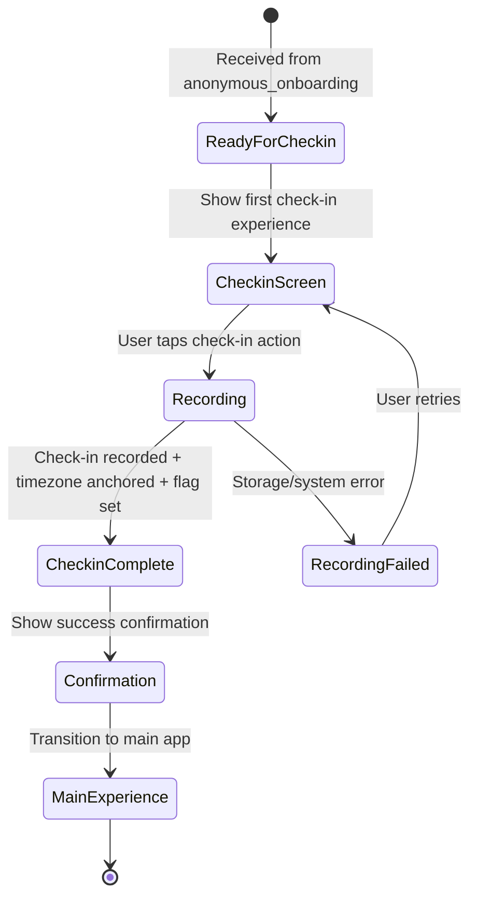
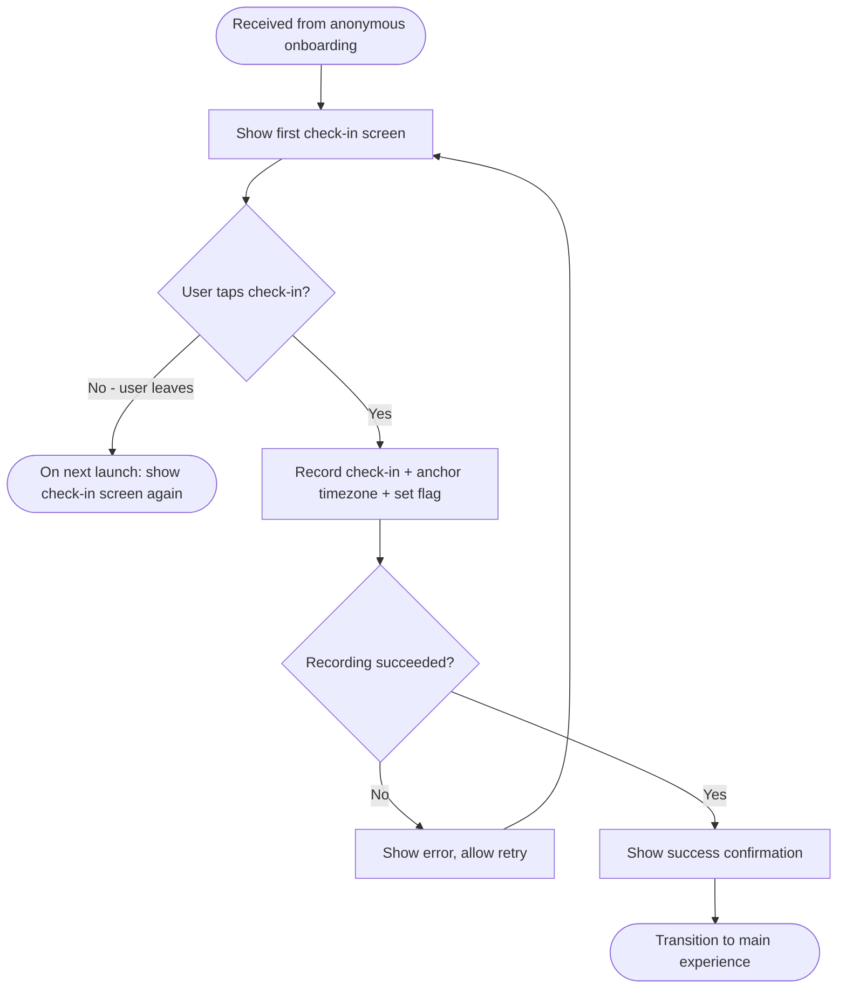

# Spec: First Check-in

**Module:** Onboarding
**Submodule:** First Check-in
**Version:** 1.2
**Status:** Draft
**Last Updated:** 2026-02-07
**Author:** BA (via Speckit)
**PRD Reference:** OKL-PRD-001 — Onboarding & First Check-in
**BRD Reference:** OKL-BRD-001

---

## 1. Overview

### 1.1 Purpose

This submodule specifies the behavior for a new user's first daily check-in — the initial moment of value realization in OKLah. It covers the guided experience from the point where anonymous onboarding is complete through to successful recording of the first check-in, including timezone anchoring.

### 1.2 Scope

**In Scope:**

- Guided first check-in experience (post-onboarding)
- Recording the first daily check-in
- Base timezone anchoring at first check-in (BR-OKL-004)
- Single check-in per day enforcement for the first check-in (BR-OKL-003)
- Confirmation/feedback on successful first check-in

**Out of Scope:**

- Anonymous session creation (handled by `onboarding/anonymous_onboarding`)
- Privacy disclosure (handled by `onboarding/anonymous_onboarding`)
- Subsequent daily check-ins beyond the first (handled by daily engagement PRD)
- Streak tracking, achievements, and engagement reinforcement (PRD-003)
- Missed check-in handling (PRD-002)
- Cross-device recovery (PRD-004)

### 1.3 Actors

| Actor | Description |
|-------|-------------|
| New User | A user who has completed anonymous onboarding and is performing their first check-in |

---

## 2. User Stories

### US-FC-001: Complete First Check-in

**As a** new user who has just completed onboarding,
**I want to** perform my first daily check-in quickly and easily,
**So that** I experience OKLah's core value immediately.

**Acceptance Criteria:**

- [ ] Given the user has completed anonymous onboarding, when they are transitioned to the first check-in flow, then they are presented with a clear and simple way to perform a check-in.
- [ ] Given the user initiates a check-in, when the check-in is recorded successfully, then the user receives clear confirmation that their first check-in is complete.
- [ ] Given the user completes their first check-in, when the check-in is recorded, then no further check-in is allowed for the same calendar day (per BR-OKL-003).

**Priority:** HIGH

---

### US-FC-002: Timezone Anchoring at First Check-in

**As a** new user completing my first check-in,
**I want** the app to anchor my "day" definition to my current timezone,
**So that** my daily check-in schedule is consistent and predictable.

**Acceptance Criteria:**

- [ ] Given the user is performing their first check-in, when the check-in is recorded, then the system captures the user's current timezone and anchors it as the base timezone for all future "calendar day" calculations.
- [ ] Given the base timezone has been anchored, when any subsequent "is it a new day?" check occurs, then the anchored timezone is used (not the device's current timezone if it changes later).

**Priority:** HIGH

---

### US-FC-003: Guided First Check-in Experience

**As a** new user,
**I want** the first check-in experience to feel guided and welcoming,
**So that** I understand what I'm doing and feel confident continuing.

**Acceptance Criteria:**

- [ ] Given the user arrives at the first check-in screen, when the screen is displayed, then it provides enough context for the user to understand what a "check-in" means in OKLah without lengthy explanation.
- [ ] Given the user arrives at the first check-in screen, when the screen is displayed, then the primary action (performing the check-in) is prominent and unambiguous.
- [ ] Given the user has completed the check-in, when confirmation is shown, then the user is guided toward the main experience (daily use).

**Priority:** MEDIUM

---

## 3. Business Rules

### BR-OKL-003: Single Daily Check-in per Calendar Day

**Description:** A user SHALL be allowed at most one check-in per calendar day.
**Condition:** User attempts to check in.
**Action:** If the user has already checked in today (per their anchored timezone), the system prevents a duplicate check-in.
**Error Message:** The user should understand they have already checked in today. The message should be non-punitive and affirming (per BR-OKL-006 spirit), e.g., "You're already checked in for today. See you tomorrow!"

**First check-in context:** For the very first check-in, there is no prior check-in to conflict with, so this rule is satisfied by default. However, if the user somehow triggers the first check-in flow twice on the same day (e.g., app restart edge case), the second attempt must be blocked.

---

### BR-OKL-004: Base Timezone Anchoring

**Description:** The "day" for daily check-in SHALL be anchored to the user's timezone at the moment of their first successful check-in.
**Condition:** First successful check-in is recorded.
**Action:** The system persists the user's current timezone offset/identifier at the moment of the first check-in. All future calendar day boundaries use this anchored timezone.
**Error Message:** N/A (this is a system behavior, not user-facing).

**Key clarifications:**

- The timezone is captured at the moment the first check-in is **successfully recorded**, not when the screen is displayed.
- If the user's device timezone changes after anchoring (e.g., travel), the anchored timezone remains authoritative for day boundaries.

---

## 4. Functional Behavior

### 4.1 Entry Point

The first check-in flow begins immediately after the `onboarding/anonymous_onboarding` submodule completes (i.e., anonymous session is created and handed off).

### 4.2 First Check-in Action

The user is presented with a clear, single action to perform their first check-in.

**Behavioral rules:**

- The check-in action must be simple — a single deliberate user action (e.g., a button tap).
- The check-in action must be prominent and the primary call-to-action on the screen.
- No additional data input is required from the user to complete the check-in (per data minimization BR-OKL-002). The check-in itself IS the action; it records "I checked in today."

### 4.3 Recording the Check-in

When the user performs the check-in action:

1. **Capture timestamp:** Record the current date and time.
2. **Anchor timezone:** Capture the device's current timezone and persist it as the base timezone (BR-OKL-004). This is a one-time operation that occurs only on the first check-in.
3. **Persist check-in record:** Persist the check-in record durably (storage mechanism defined by implementation plan).
4. **Enforce single check-in rule:** Mark today (per the anchored timezone) as "checked in" to prevent duplicates (BR-OKL-003).
5. **Set onboarding-complete flag:** Set the `onboarding_complete` flag to `true`. This flag is the sole signal that the routing gate (defined in `anonymous_onboarding` §4.1) uses to determine whether the user has completed onboarding. This submodule is the **only writer** of this flag.

### 4.4 Confirmation & Transition

After successful recording:

1. Display a clear confirmation that the first check-in was successful.
2. The confirmation should be positive and welcoming (aligned with BR-OKL-006 spirit).
3. Transition the user to the main app experience (daily use screen).

### 4.5 Post-First-Check-in Behavior

Once the first check-in is complete:

- The `onboarding_complete` flag (set in §4.3 step 5) is `true`. This is the authoritative signal — owned and written solely by this submodule — that tells the routing gate (`anonymous_onboarding` §4.1) the user has completed onboarding.
- Subsequent app launches go directly to the main experience (routing gate sees valid session + flag `true`).
- Subsequent check-ins are handled by the daily engagement flow (outside this submodule's scope).

---

## 5. State Transitions

---

## 6. Validation Rules

| Rule | Description |
|------|-------------|
| VR-FC-001 | The user must have a valid anonymous session before a check-in can be recorded. If no session exists, redirect to onboarding. |
| VR-FC-002 | A check-in can only be recorded once per calendar day (per anchored timezone). On the first check-in, this is trivially satisfied but must still be enforced for edge cases. |
| VR-FC-003 | The timezone must be captured and anchored at the moment of the first successful check-in. If timezone cannot be determined, the check-in must still succeed (see E-FC-003). |
| VR-FC-004 | The check-in record and the `onboarding_complete` flag must both be persisted before confirmation is shown to the user. Do not confirm an unrecorded check-in. If the check-in is persisted but the flag write fails (e.g., crash), E-FC-002 provides recovery. |

---

## 7. Error & Edge Cases

| # | Scenario | Expected Behavior |
|---|----------|-------------------|
| E-FC-001 | User force-closes app after tapping check-in but before recording completes. | On next launch, the 3-state routing gate (`anonymous_onboarding` §4.1) determines the destination: (a) check-in + flag both persisted → main experience; (b) check-in persisted but flag missing → first check-in screen, where E-FC-002 detects the existing check-in and recovers (sets flag, transitions to main); (c) neither persisted → first check-in screen for retry. The user is never sent back to the privacy disclosure because a valid session exists. |
| E-FC-002 | User arrives at first check-in screen but has already checked in today (e.g., edge case with app restart, or crash between check-in persist and flag write). | System detects existing check-in for today. Set `onboarding_complete` flag to `true` if not already set (recovery for partial-persist crash). Display "already checked in" message and transition to main experience. |
| E-FC-003 | Device timezone cannot be determined at the moment of first check-in. | Record the check-in anyway. Use UTC as the fallback timezone anchor. Log the anomaly for analytics. |
| E-FC-004 | Local storage is full and the check-in cannot be persisted. | Display a user-friendly error: the user understands the check-in could not be saved. Do NOT show a success confirmation. Allow retry. |
| E-FC-005 | User navigates backward from the first check-in screen (e.g., swipe back). | The user has already completed onboarding (session exists). If they re-enter the app, they should see the check-in screen again — NOT the privacy disclosure. |
| E-FC-006 | User performs first check-in at exactly midnight boundary in their timezone. | The system uses the timestamp at the moment the action is initiated (tap) to determine which calendar day the check-in belongs to. |

---

## 8. Acceptance Criteria (Summary)

| # | Criterion | Traces To |
|---|-----------|-----------|
| AC-FC-01 | A new user can complete their first check-in with a single, simple action. | G-03 |
| AC-FC-02 | The first check-in does not require any data input beyond the action itself. | BR-OKL-002 |
| AC-FC-03 | The user's timezone is anchored at the moment of first successful check-in. | BR-OKL-004 |
| AC-FC-04 | No duplicate check-in is allowed on the same calendar day. | BR-OKL-003 |
| AC-FC-05 | The user receives clear, positive confirmation upon successful first check-in. | G-03 |
| AC-FC-06 | After first check-in, the user is transitioned to the main experience. | G-03 |
| AC-FC-07 | The first check-in flow is only shown once; returning users go directly to the main experience. | G-01 |
| AC-FC-08 | The `onboarding_complete` flag is set to `true` after the first check-in succeeds. This flag is the sole signal for the routing gate (`anonymous_onboarding` §4.1). | §4.3 step 5, §4.5 |

---

## 9. Analytics (Business-Level Intent)

| Event | Intent | Notes |
|-------|--------|-------|
| `first_checkin_screen_shown` | Track how many users reach the first check-in screen after onboarding. | Funnel metric: onboarding completion -> check-in opportunity. |
| `first_checkin_attempted` | Track when the user initiates the check-in action. | Measures intent to engage. |
| `first_checkin_completed` | Track successful recording of the first check-in. | Primary success metric for this PRD. Maps to "% of installs completing first check-in." |
| `first_checkin_failed` | Track check-in recording failures. | Should be near-zero. Spikes indicate storage or system issues. |
| `first_checkin_time_elapsed` | Track time from `onboarding_completed` to `first_checkin_completed`. | Maps to "time from first open to first check-in." |
| `timezone_anchored` | Confirm timezone was captured and anchored. | Operational metric; should match `first_checkin_completed` 1:1 (with UTC fallback counted). |

---

## 10. Workflow / Process Flow

---

## 11. Related Documentation

### 11.1 Upstream Dependencies

| Document / Submodule | Purpose |
|----------------------|---------|
| OKL-BRD-001 | Authoritative business rules (BR-OKL-003, BR-OKL-004) |
| OKL-PRD-001 | Product requirements for onboarding & first check-in |
| `onboarding/anonymous_onboarding` | Provides the anonymous session; this submodule's entry point |

### 11.2 Downstream Consumers

| Consumer | Purpose |
|----------|---------|
| Daily engagement flow (future PRD-002/003 scope) | Subsequent check-ins build on the first check-in's timezone anchor and session |

---

## 12. Open Questions / TBD

| # | Question | Status | Decision |
|---|----------|--------|----------|
| — | None | — | All decisions resolved at PRD level |

---

## 13. Change Log

| Version | Date | Author | Changes |
|---------|------|--------|---------|
| 1.0 | 2026-02-06 | BA (via Speckit) | Initial draft generated from OKL-PRD-001 |
| 1.1 | 2026-02-07 | BA (via Speckit) | Post-clarify: (1) §4.3 step 5 added — `onboarding_complete` flag set by this submodule; (2) §4.3 step 3 changed to storage-agnostic wording; (3) §4.5 updated with explicit flag ownership declaration; (4) VR-FC-004 updated to cover flag persistence ordering; (5) E-FC-001 updated for 3-state routing recovery paths |
| 1.2 | 2026-02-07 | BA (via Speckit) | Clarify pass 2: (1) §5 state diagram label includes flag set; (2) AC-FC-08 added — flag is sole routing gate signal; (3) E-FC-002 updated with flag recovery for partial-persist crash (fixes logical loop); (4) §10 flowchart label includes flag set |
