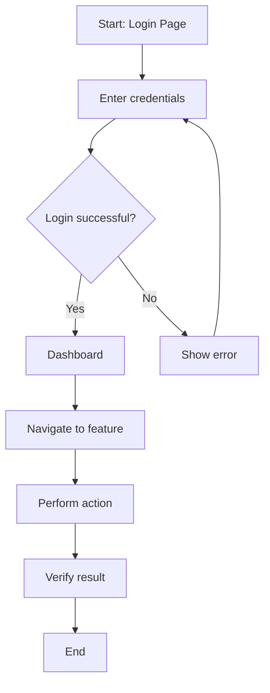

# E2E Test Template

Copy this template to create end-to-end test specifications for user workflows and journeys.

**Output Location:** `docs/test/frontend_backoffice/e2e_tests.md` or `docs/test/frontend_mobile/e2e_tests.md`

---

# [FEATURE_NAME] E2E Tests

**Feature:** [Feature Name]
**Version:** 1.0
**Status:** Draft | Review | Approved | Implemented
**Last Updated:** [YYYY-MM-DD]
**FSD Reference:** `docs/fsd/[module]/[page]/spec.md`
**Platform:** Web (Backoffice) | Mobile (Android) | Both

---

## Source Code Reference

> **Purpose:** This section tracks which version of the source code these E2E tests cover.
> When code changes, compare against this reference to identify test updates needed.

| Field | Value |
|-------|-------|
| Repository | `[repository-url]` |
| Branch | `[branch-name]` |
| Commit Hash | `[full-commit-hash]` |
| Commit Date | `[YYYY-MM-DD HH:MM:SS]` |
| Commit Message | `[commit-message-summary]` |

**Source Files Covered:**

```
[List the source code files covered by these tests]
- src/path/to/file1.ts
- src/path/to/file2.ts
```

**How to check for updates:**

```bash
# View commits since this reference
git log [commit-hash]..HEAD --oneline -- [relevant-paths]

# View detailed changes since reference
git diff [commit-hash]..HEAD -- [relevant-paths]
```

---

## 1. Overview

### 1.1 Purpose

[Describe the user journeys and workflows being tested end-to-end]

### 1.2 User Roles Covered

| Role | Permissions | Test Coverage |
|------|-------------|---------------|
| SUPERADMIN | Full access | Full workflow |
| ADMIN | Company-level access | Standard workflow |
| STORE_MANAGER | Store-level access | Limited workflow |
| CASHIER | POS operations only | Basic workflow |

### 1.3 Test Scope

**User Journeys:**
1. [User Journey 1 - e.g., Complete purchase flow]
2. [User Journey 2 - e.g., User registration and login]
3. [User Journey 3 - e.g., Report generation]

**Out of Scope:**
- [What is not tested E2E]

---

## 2. Test Environment

### 2.1 Environment Configuration

| Setting | Value |
|---------|-------|
| Base URL | `https://staging.example.com` |
| API URL | `https://staging-api.example.com` |
| Browser | Chrome (latest), Firefox (latest), Safari (latest) |
| Mobile Device | Android 12+, Pixel 6 emulator |
| Screen Resolution | 1920x1080 (Desktop), 393x873 (Mobile) |

### 2.2 Test Data

| Data | Value | Purpose |
|------|-------|---------|
| Test Company | `company_id: 1, name: "Test Company"` | Multi-tenant tests |
| Test Store | `store_id: 1, name: "Test Store"` | Store context tests |
| Test User | `username: e2e_user@test.com` | Authentication tests |
| Test Product | `sku: TEST-001, name: "Test Product"` | Transaction tests |

### 2.3 Prerequisites

- [ ] Test environment is deployed and accessible
- [ ] Test data is seeded
- [ ] Test user accounts are created
- [ ] External services are available or mocked

---

## 3. User Journey Tests

### 3.1 [User Journey Name]

**Description:** [High-level description of the user journey]

**User Story:** As a [role], I want to [action] so that [benefit].

**Preconditions:**
- [Required state before starting]
- [User must be logged in as X role]

**Flow Diagram:**



---

#### E2E-001: [Test Scenario Name]

**Priority:** P0 | P1 | P2
**Estimated Duration:** [X minutes]
**Automation Status:** Manual | Automated | Planned

**Test Data:**

| Field | Value |
|-------|-------|
| Username | `e2e_user@test.com` |
| Password | `TestPass123!` |
| [Field] | [Value] |

**Steps:**

| Step | Action | Expected Result | Screenshot |
|------|--------|-----------------|------------|
| 1 | Navigate to `[URL]` | Login page is displayed | login_page.png |
| 2 | Enter username `[value]` | Username field populated | - |
| 3 | Enter password `[value]` | Password field masked | - |
| 4 | Click "Sign In" button | Loading indicator shown | - |
| 5 | Wait for redirect | Dashboard page displayed | dashboard.png |
| 6 | Verify welcome message | Shows "Welcome, [username]" | - |
| 7 | Navigate to `[feature]` | Feature page displayed | feature_page.png |
| 8 | [Action] | [Expected result] | - |
| 9 | Verify [condition] | [Expected state] | - |
| 10 | [Final action] | [Final verification] | final_state.png |

**Assertions:**
- [ ] User is redirected to correct page
- [ ] All UI elements are visible and correctly labeled
- [ ] Data is persisted correctly in database
- [ ] Success notification is displayed
- [ ] No console errors in browser

**Cleanup:**

```sql
-- Cleanup test data after test
DELETE FROM [table] WHERE [condition];
```

---

#### E2E-002: [Error Handling Scenario]

**Priority:** P1
**Description:** Verify error handling when [error condition]

**Steps:**

| Step | Action | Expected Result |
|------|--------|-----------------|
| 1 | [Setup step] | [State] |
| 2 | [Trigger error condition] | [Error state] |
| 3 | Verify error message | Error message: "[expected message]" |
| 4 | Verify recovery action | User can [recover] |

**Assertions:**
- [ ] Error message is user-friendly
- [ ] No data corruption occurred
- [ ] User can retry or recover

---

### 3.2 [Second User Journey]

[Repeat the structure above for additional user journeys]

---

## 4. Cross-Browser Tests

### 4.1 Browser Compatibility Matrix

| Test Case | Chrome | Firefox | Safari | Edge |
|-----------|--------|---------|--------|------|
| E2E-001 | ✅ | ✅ | ✅ | ✅ |
| E2E-002 | ✅ | ✅ | ✅ | ✅ |
| E2E-003 | ✅ | ✅ | ⚠️ | ✅ |

**Legend:** ✅ Pass | ❌ Fail | ⚠️ Known Issue | ⬜ Not Tested

### 4.2 Known Browser-Specific Issues

| Issue | Browser | Workaround |
|-------|---------|------------|
| [Issue description] | Safari | [Workaround] |

---

## 5. Mobile-Specific Tests (if applicable)

### 5.1 Device Matrix

| Test Case | Android 12 | Android 13 | Android 14 |
|-----------|------------|------------|------------|
| E2E-001 | ✅ | ✅ | ✅ |
| E2E-002 | ✅ | ✅ | ✅ |

### 5.2 Mobile-Specific Scenarios

#### E2E-M001: [Mobile-Specific Test]

**Device:** Android [version], [device model]
**Orientation:** Portrait | Landscape

**Steps:**

| Step | Action | Expected Result |
|------|--------|-----------------|
| 1 | Launch app | Splash screen displayed |
| 2 | [Action] | [Result] |

**Mobile-Specific Assertions:**
- [ ] Touch targets are minimum 44x44 pixels
- [ ] Keyboard appears/dismisses correctly
- [ ] App handles orientation changes
- [ ] Offline mode works correctly

---

## 6. Accessibility Tests

### 6.1 Accessibility Requirements

| Requirement | Standard | Test Method |
|-------------|----------|-------------|
| Keyboard Navigation | WCAG 2.1 AA | Manual + aXe |
| Screen Reader | WCAG 2.1 AA | NVDA/VoiceOver |
| Color Contrast | WCAG 2.1 AA | Automated |
| Focus Indicators | WCAG 2.1 AA | Visual inspection |

### 6.2 Accessibility Test Cases

| ID | Test | Expected Result |
|----|------|-----------------|
| A11Y-001 | Navigate using only keyboard | All interactive elements reachable |
| A11Y-002 | Screen reader announces content | All content properly announced |
| A11Y-003 | Color contrast check | Minimum 4.5:1 ratio |

---

## 7. Performance Expectations

### 7.1 Page Load Times

| Page | Target Load Time | Maximum |
|------|------------------|---------|
| Login | < 2s | 3s |
| Dashboard | < 3s | 5s |
| [Feature Page] | < 2s | 4s |

### 7.2 User Action Response Times

| Action | Target | Maximum |
|--------|--------|---------|
| Button click response | < 100ms | 300ms |
| Form submission | < 1s | 3s |
| Data load | < 2s | 5s |

---

## 8. Test Automation Reference

### 8.1 Cypress (Web)

```javascript
describe('[Feature] E2E Tests', () => {
  beforeEach(() => {
    cy.login('e2e_user@test.com', 'TestPass123!');
  });

  it('E2E-001: should [test description]', () => {
    // Navigate to feature
    cy.visit('/feature');
    cy.get('[data-testid="feature-title"]').should('be.visible');

    // Perform action
    cy.get('[data-testid="action-button"]').click();
    cy.get('[data-testid="input-field"]').type('test value');
    cy.get('[data-testid="submit-button"]').click();

    // Verify result
    cy.get('[data-testid="success-message"]')
      .should('be.visible')
      .and('contain', 'Success');

    // Verify database (via API)
    cy.request('/api/v1/resource/1').then((response) => {
      expect(response.body.data.field).to.eq('test value');
    });
  });
});
```

### 8.2 Playwright (Web)

```typescript
import { test, expect } from '@playwright/test';

test.describe('[Feature] E2E Tests', () => {
  test.beforeEach(async ({ page }) => {
    await page.goto('/login');
    await page.fill('[data-testid="username"]', 'e2e_user@test.com');
    await page.fill('[data-testid="password"]', 'TestPass123!');
    await page.click('[data-testid="login-button"]');
    await page.waitForURL('/dashboard');
  });

  test('E2E-001: should [test description]', async ({ page }) => {
    // Navigate to feature
    await page.goto('/feature');
    await expect(page.locator('[data-testid="feature-title"]')).toBeVisible();

    // Perform action
    await page.click('[data-testid="action-button"]');
    await page.fill('[data-testid="input-field"]', 'test value');
    await page.click('[data-testid="submit-button"]');

    // Verify result
    await expect(page.locator('[data-testid="success-message"]'))
      .toBeVisible();
    await expect(page.locator('[data-testid="success-message"]'))
      .toContainText('Success');
  });
});
```

### 8.3 Espresso (Android)

```kotlin
@RunWith(AndroidJUnit4::class)
class FeatureE2ETest {

    @get:Rule
    val activityRule = ActivityScenarioRule(MainActivity::class.java)

    @Before
    fun setup() {
        // Login
        onView(withId(R.id.username)).perform(typeText("e2e_user@test.com"))
        onView(withId(R.id.password)).perform(typeText("TestPass123!"))
        onView(withId(R.id.loginButton)).perform(click())

        // Wait for dashboard
        onView(withId(R.id.dashboard)).check(matches(isDisplayed()))
    }

    @Test
    fun e2e001_shouldCompleteUserJourney() {
        // Navigate to feature
        onView(withId(R.id.featureButton)).perform(click())
        onView(withId(R.id.featureTitle)).check(matches(isDisplayed()))

        // Perform action
        onView(withId(R.id.inputField)).perform(typeText("test value"))
        onView(withId(R.id.submitButton)).perform(click())

        // Verify result
        onView(withId(R.id.successMessage))
            .check(matches(isDisplayed()))
            .check(matches(withText(containsString("Success"))))
    }
}
```

---

## 9. Test Execution Checklist

### 9.1 Pre-Execution

- [ ] Test environment is up and running
- [ ] Test data has been seeded
- [ ] All test accounts are accessible
- [ ] Browser/device configurations are ready
- [ ] Test automation framework is configured

### 9.2 Execution

- [ ] All P0 tests passed
- [ ] All P1 tests passed
- [ ] Cross-browser tests completed
- [ ] Mobile tests completed (if applicable)
- [ ] Accessibility tests completed
- [ ] Performance benchmarks met

### 9.3 Post-Execution

- [ ] Test results documented
- [ ] Screenshots/videos captured for failures
- [ ] Defects logged with reproduction steps
- [ ] Test data cleaned up

---

## 10. Change Log

| Version | Date | Author | Changes |
|---------|------|--------|---------|
| 1.0 | [Date] | [Author] | Initial creation |
